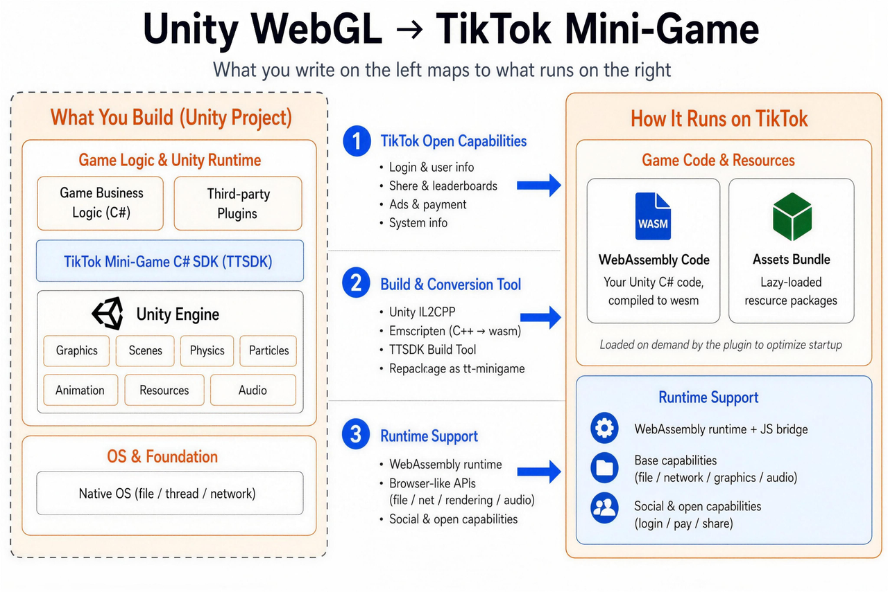
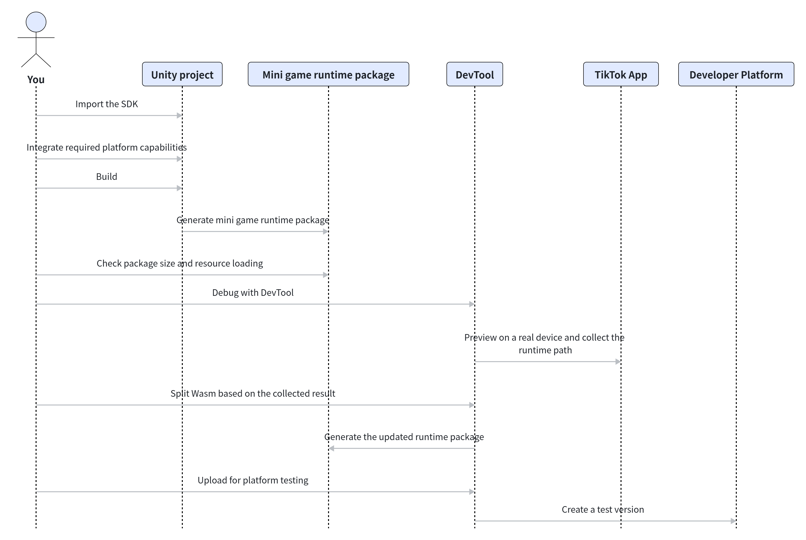
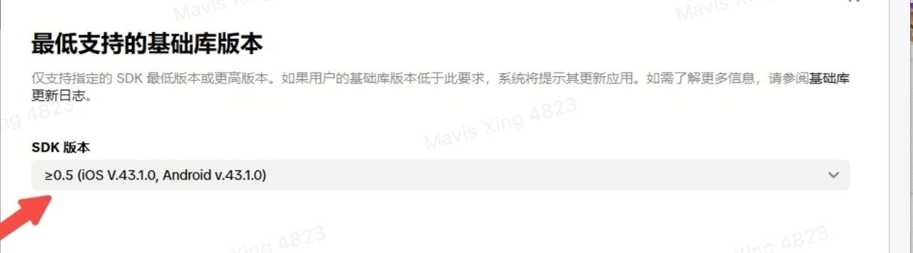
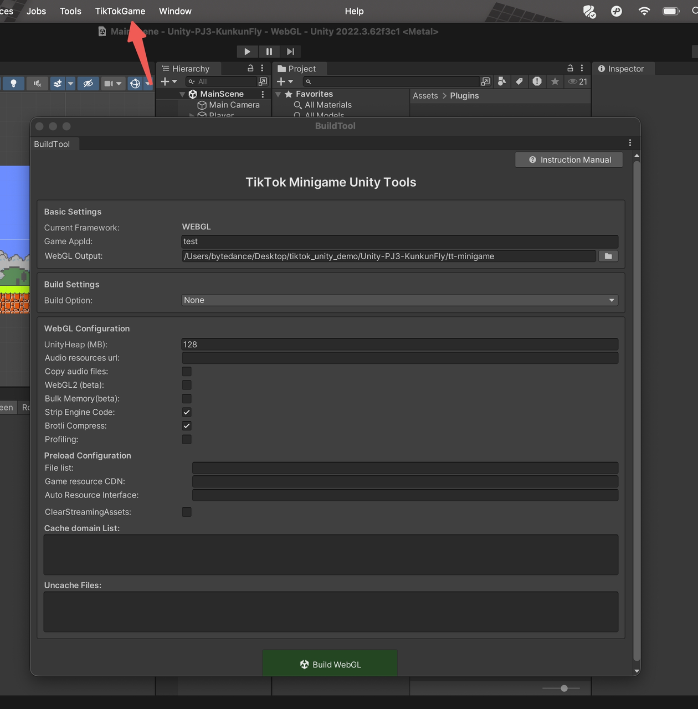

# Hướng dẫn tích hợp TikTok Mini Games cho Unity

Sử dụng hướng dẫn này khi bạn đã có sẵn một game Unity và cần đóng gói (build) thành TikTok Mini Games, xem trước trên thiết bị thật, và tải lên một phiên bản để nền tảng kiểm thử.

Hướng dẫn này bao gồm lộ trình tích hợp Unity: cài đặt TikTok Unity SDK, build gói runtime (thời gian chạy) của mini game, gỡ lỗi bằng DevTool, xác thực trong ứng dụng TikTok, và tải lên để kiểm thử. Hãy sử dụng các tài liệu hướng dẫn chuyên biệt cho các tính năng Đăng nhập, Ủy quyền (Authorization), IAP (Mua hàng trong ứng dụng), Quảng cáo (Ads), Chia sẻ, và quay lại (revisit).

## I. Tổng quan kỹ thuật



Tuyệt đối không tải lên (upload) trực tiếp project Unity hay thư mục build WebGL tiêu chuẩn. Hãy import TikTok Unity SDK và tích hợp các tính năng nền tảng mà bạn cần, sau đó build gói runtime cho mini game và kiểm tra kích thước gói cũng như việc tải tài nguyên. Tiếp theo, gỡ lỗi (debug) bằng DevTool và xem trước trên thiết bị thực. Nếu cần chia tách Wasm (Wasm splitting), hãy thu thập đường dẫn runtime thực tế trước, sau đó chia tách và xác thực lại. Cuối cùng, tải lên nền tảng để kiểm thử.



| Đối tượng | Cần xác minh những gì |
| :--- | :--- |
| Project Unity | TikTok Unity SDK đã được import; cấu hình build, quá trình tải tài nguyên, và các lệnh gọi nền tảng đều sử dụng cùng một TikTok SDK. |
| Gói runtime mini game | Đây là thư mục xuất (export) được sử dụng bởi DevTool và nền tảng. Đây không phải là thư mục chứa mã nguồn Unity của bạn hay thư mục đầu ra WebGL tiêu chuẩn. |
| DevTool | Sử dụng để gỡ lỗi cục bộ (local), gỡ lỗi từ xa, xem trước trên thiết bị thật, Tùy chọn nhà phát triển (Developer Options), kiểm tra mã nguồn (code pre-check), và tải lên nền tảng để kiểm thử. |
| Ứng dụng TikTok | Sử dụng để xác thực runtime thực tế, độ tương thích của thiết bị, kết nối mạng, tải tài nguyên, và các callback từ nền tảng. |

## II. Các bước chính (Key Steps)

### 1. Xác nhận yêu cầu về project và phiên bản


- Đảm bảo rằng project có thể build ra bản WebGL ổn định và giữ nguyên một cấu hình build Unity có thể tái tạo (reproducible).
- Hướng dẫn này cung cấp các chỉ dẫn build ổn định cho Unity 2021 và Unity 2022. Unity 6 chưa phải là phiên bản tương thích cơ sở được ghi nhận trong tài liệu. Nếu bạn cần sử dụng Unity 6, hãy xác thực bản build thử nghiệm trên thiết bị thực trước, và cung cấp gói (package) cùng log khi báo cáo lỗi.
- Không trộn lẫn các Unity SDK của Douyin, WeChat hay các nền tảng phân phối khác. Các hàm API, kịch bản build (build script), và các tính năng runtime của chúng không thể dùng thay thế cho nhau.

### 2. Cài đặt TikTok Unity SDK
Các gói Unity plugin dưới đây được giữ lại từ hướng dẫn trước. Đối với project mới, hãy lấy package từ bản phát hành SDK hiện tại; sử dụng các tệp đính kèm này để kiểm tra độ tương thích với project cũ, theo dõi nâng cấp (upgrade tracing), hoặc tái tạo lỗi cũ (regression reproduction).

- [TikTok-Unity-SDK_2026-03-30_032756_EN.unitypackage](./Package/TikTokMiniGamesUnityIntegrationGuide/TikTok-Unity-SDK_2026-03-30_032756_EN.unitypackage)
- [TikTok-Unity-SDK_2026-03-31_104624_TTAssetBundle-fix_EN.unitypackage](./Package/TikTokMiniGamesUnityIntegrationGuide/TikTok-Unity-SDK_2026-03-31_104624_TTAssetBundle-fix_EN.unitypackage)
- [TikTok-Unity-SDK_2026-05-26_025740_Runtime-local-package_EN.unitypackage](./Package/TikTokMiniGamesUnityIntegrationGuide/TikTok-Unity-SDK_2026-05-26_025740_Runtime-local-package_EN.unitypackage)
- [TikTok-Unity-SDK_2026-05-28_030846_Stripping-fix_EN.unitypackage](./Package/TikTokMiniGamesUnityIntegrationGuide/TikTok-Unity-SDK_2026-05-28_030846_Stripping-fix_EN.unitypackage)
- [TikTok-Unity-SDK_2026-05-28_092959_EN.unitypackage](./Package/TikTokMiniGamesUnityIntegrationGuide/TikTok-Unity-SDK_2026-05-28_092959_EN.unitypackage)

Lấy Unity SDK package mới nhất từ bản phát hành TikTok Mini Games SDK và import nó vào project Unity. Không chọn các package từ ảnh chụp màn hình cũ, tệp đính kèm lịch sử, hoặc SDK của các nền tảng khác.

- Ghi lại phiên bản Unity, phiên bản SDK và thời gian build sau khi import. Bạn sẽ cần tất cả thông tin này để khắc phục sự cố.
- Nếu không tìm thấy tùy chọn build Unity hoặc việc import gây ra lỗi biên dịch, trước tiên hãy kiểm tra lại source của SDK, phiên bản Unity, và các xung đột với plugin hiện có.
- [Project Unity demo](https://github.com/AnranS/tiktok-minigame-unity-demo.git) giúp bạn hiểu cách tổ chức project và xác thực lộ trình cơ bản. Tuy nhiên, nó không thay thế cho gói SDK phát hành hiện tại.

### 3. Tích hợp các tính năng nền tảng (Integrate platform capabilities)
Unity SDK cung cấp các tính năng của nền tảng cho C#. Luồng nghiệp vụ (business flow), trách nhiệm của máy chủ, xử lý lỗi, và tiêu chí nghiệm thu của mỗi tính năng đều nằm trong tài liệu hướng dẫn riêng của nó.
Khởi tạo runtime tối thiểu: khởi tạo SDK trước khi gọi bất kỳ TikTok Unity API nào. Nếu khởi tạo thất bại, hãy dừng các lệnh gọi API nền tảng sau đó và giữ lại chi tiết lỗi.

```csharp
using TTSDK;

void Start()
{
    TT.InitSDK((code, env) =>
    {
        if (code != 0)
        {
            Debug.LogError($"Khởi tạo TikTok Unity SDK thất bại: {code}");
            return;
        }

        // Gọi TikTok Unity APIs sau khi khởi tạo thành công.
    });
}
```

| Bạn cần gì (What you need) | Đọc tài liệu hướng dẫn này (Read this guide) |
| :--- | :--- |
| Xác định người dùng để lưu game, nhận thưởng, bảng xếp hạng, hoặc backend | Hướng dẫn tích hợp Đăng nhập (Login Integration Guide) |
| Yêu cầu quyền (scopes), lấy dữ liệu hồ sơ người dùng, hoặc gọi Open API bảo mật | Hướng dẫn tích hợp Ủy quyền Người dùng (User Authorization Integration Guide) |
| Mua hàng trong ứng dụng (IAP), xác minh, thực hiện, khôi phục hoặc giả lập thanh toán (Payment Mock) | Hướng dẫn tích hợp IAP (IAP Integration Guide) |
| Video có phần thưởng, quảng cáo xen kẽ, kích hoạt ad-unit, hoặc giả lập IAA | Hướng dẫn tích hợp Kiếm tiền từ Quảng cáo (Ad Monetization Integration Guide) |
| Chia sẻ, phím tắt màn hình chính (desktop shortcut), hoặc sidebar revisit | Hướng dẫn tạo phím tắt (Desktop Shortcut Revisit Guide); Hướng dẫn Sidebar Revisit |
| Kiểm tra xem một runtime API có được hỗ trợ hay không | Tham chiếu Khả năng Runtime (Runtime Capability Reference) |

### 4. Build gói runtime mini game

<br>


Tiến hành build project cho TikTok Mini Games trong Unity, sau đó mở thư mục đầu ra của bản build. Các project hiện tại thường đặt tên thư mục này là `tt-minigame`; hãy sử dụng thư mục được tạo ra từ cấu hình build hiện tại của bạn.
Gói runtime bắt buộc phải bao gồm tệp đầu vào (platform entry) và các tệp cấu hình của nền tảng, chẳng hạn như `game.js` và `game.json`. Hơn nữa, `game.json` phải xác định `gameEngine: "unity"`. Tuyệt đối không upload thư mục gốc mã nguồn Unity, `Assets`, `Library`, hoặc một thư mục WebGL tiêu chuẩn chưa qua xử lý.

### 5. Xử lý kích thước gói và tải tài nguyên
- **Kích thước gói:** giới hạn kích thước tổng thể hiện tại cho Unity là 60MB. Khi gói vượt quá giới hạn, trước tiên hãy loại bỏ các tài nguyên (assets) không sử dụng, tài nguyên trùng lặp, và rác sinh ra trong quá trình build, sau đó kiểm tra `.data`, `.wasm`, và các tài nguyên dùng cho màn hình đầu tiên. Các quy tắc thông thường về gói chính (main-package) và gói phụ độc lập (independent-subpackage) của mini game không áp dụng trực tiếp cho project Unity; hãy tham khảo phần Giới hạn Kích thước Gói (Package Size Limits) để biết các khái niệm liên quan.
- **Tải tài nguyên:** sử dụng AssetBundle, Addressables, hoặc một giải pháp CDN khi các tài nguyên không dùng cho màn hình đầu tiên cần tải xuống theo yêu cầu hoặc tái sử dụng. Xác thực URL tài nguyên, quản lý phiên bản (versioning), và hành vi lưu bộ nhớ đệm (cache) trong mỗi bản phát hành. Việc chỉ có một Danh sách Domain Cache (Cache Domain List) không chứng minh được rằng Addressables caching hoạt động đúng. Xem mục Đóng gói Unity và Tối ưu hóa Tài nguyên (Unity Packaging and Resource Optimization).

**Ranh giới lưu trữ (Storage boundary):** Đừng mặc định rằng `Application.persistentDataPath` của Unity hay file IO trong C# sẽ được lưu trữ vĩnh viễn trong mọi trạng thái runtime hiện hành. Hãy làm theo hướng dẫn hiện tại của Unity SDK đối với `TT.PlayerPrefs` khi muốn lưu các tùy chọn/tùy chỉnh nhỏ. Sử dụng các API hệ thống tệp tin (file-system APIs) của SDK để lưu file save hoặc dữ liệu game, và xác minh rằng dữ liệu cũ có thể được đọc lại sau khi nâng cấp phiên bản.

### 6. Chạy thử gỡ lỗi cục bộ (local debugging) và xem trước (preview)
- **Bắt đầu môi trường gỡ lỗi:** Sử dụng Hướng dẫn sử dụng TikTok Mini Games DevTool trong thư mục gói runtime mini game đã xuất ra. Làm theo hướng dẫn đó để cấu hình quyền test, cấu hình domain (request domains), gỡ lỗi từ xa (remote debugging), và xem trước trên thiết bị thực (real-device preview).
- **Xem trước trên thiết bị thực:**
  - Xác thực tối thiểu: mở mã QR của DevTool trong Ứng dụng TikTok và xác thực các bước sau trên thiết bị mục tiêu: khởi chạy lần đầu, khởi chạy lần hai, quá trình tải tài nguyên, trở lại từ chế độ nền lên tiền cảnh (background-to-foreground return), các yêu cầu mạng, và giao diện người dùng (UI).
  - Ranh giới xác thực: Việc game chạy thành công trên Unity Editor không chứng minh được rằng game sẽ hoạt động tốt trong Ứng dụng TikTok. Việc xem trước trên thiết bị thực giúp xác thực môi trường runtime và luồng hoạt động của thiết bị; việc này không giống như xác thực một phiên bản chính thức (production version).
- **Chia tách Wasm (Wasm splitting):** Khi `game.json.wasmFuncCount` có giá trị từ 80000 trở lên, hoặc khi bạn cần cải thiện quá trình biên dịch lúc khởi động, tối ưu bộ nhớ, hoặc hiệu suất màn hình đầu tiên, trước tiên hãy thu thập đường dẫn runtime thực tế (actual runtime path) thông qua tính năng xem trước trên thiết bị thực của DevTool. Sau đó, làm theo Hướng dẫn chia tách mã Wasm Unity (Unity Wasm Code Splitting Guide) để hoàn tất chia tách Wasm và xác thực lại phần hướng dẫn chơi (tutorial) cùng các level đầu tiên.

### 7. Tải lên để nền tảng kiểm thử
Sau khi kiểm tra trước trên thiết bị thực đạt yêu cầu, hãy dùng DevTool để tải lên một phiên bản thử nghiệm (platform test version). Xem Hướng dẫn sử dụng TikTok Mini Games DevTool để biết các lệnh tải lên, kiểm tra phiên bản và quy trình thử nghiệm. Trước khi tải lên, hãy xác nhận rằng tài khoản thử nghiệm đã có quyền test (testing permission) đối với Client Key.

### III. Câu hỏi thường gặp (FAQ)

**1. Game chạy tốt trong Unity Editor. Tại sao lại không mở được hoặc bị treo trong Ứng dụng TikTok?**
Việc chạy trên Editor chỉ chứng minh rằng project Unity có thể khởi động. Điều này không chứng minh rằng gói runtime mini game, TikTok Runtime, tài nguyên thiết bị, và cấu hình mạng là chính xác.
Hãy xác nhận mã QR trỏ đến đúng thư mục được export mới nhất, sau đó kiểm tra `game.js`, `game.json`, log build, kích thước gói, và lỗi đầu tiên báo trong DevTool. Nếu game vẫn không thể khởi động, hãy cung cấp Client Key, phiên bản Unity/SDK, phiên bản ứng dụng TikTok, System Info, log build, và video quay màn hình.

**2. Tôi nên tải lên (upload) project Unity, thư mục WebGL, hay `tt-minigame`?**
Hãy tải lên gói runtime mini game được export bởi TikTok Unity SDK. Các project hiện tại thường đặt tên thư mục này là `tt-minigame`, nhưng hãy sử dụng đúng thư mục được tạo ra từ cấu hình build hiện tại của bạn.
Tuyệt đối không tải lên thư mục gốc mã nguồn Unity, `Assets`, `Library`, hoặc thư mục WebGL tiêu chuẩn chưa được xử lý bởi TikTok SDK.

**3. Sự khác biệt giữa `ttmg dev` và `ttmg upload` là gì?**
`ttmg dev` khởi tạo gỡ lỗi cục bộ, xem trước bằng mã QR, gỡ lỗi từ xa và xem trước trên thiết bị thực. `ttmg upload` thực hiện upload gói runtime và tạo một phiên bản platform test (kiểm thử nền tảng) hoặc preview version.
Việc gỡ lỗi cục bộ thành công không đồng nghĩa với việc phiên bản được tải lên hoặc ứng dụng online thực tế sẽ hoạt động chuẩn xác.

**4. Tôi có thể sử dụng Unity 6 không?**
Hướng dẫn này cung cấp các chỉ dẫn build ổn định cho Unity 2021 và Unity 2022. Unity 6 không nên được xem là phiên bản đảm bảo độ tương thích cơ sở.
Nếu project bắt buộc phải dùng Unity 6, hãy xác thực quá trình build, khởi chạy, tải tài nguyên, và các tính năng cốt lõi bằng gói kiểm thử trên Ứng dụng TikTok. Vui lòng đính kèm gói game, phiên bản Unity, và log build khi báo cáo lỗi.

**5. Tại sao tôi tìm thấy một API trong Unity SDK của nền tảng khác nhưng lại không có trong TikTok Unity SDK?**
Đừng sử dụng lẫn lộn SDK, tên API, hay các ví dụ mẫu từ Douyin, WeChat hay các nền tảng khác. Các Unity SDK từ các nền tảng phân phối khác nhau không đảm bảo có chung bề mặt API.
Đầu tiên, hãy xác nhận xem project đã import đúng TikTok Unity SDK chưa. Sau đó kiểm tra lại Tham chiếu Khả năng Runtime (Runtime Capability Reference). Nếu một tính năng không có mặt trong tham chiếu, hãy coi như tính năng đó không được hỗ trợ.

**6. Tại sao các file được ghi thông qua IO file C# hoặc PlayerPrefs nguyên bản lại biến mất sau khi khởi động lại?**
Đường dẫn persistent mặc định và mô hình đồng bộ file của Unity không đảm bảo lưu trữ vĩnh viễn cho runtime của mini game, đặc biệt sau khi di chuyển bộ nhớ hoặc nâng cấp runtime.
Hãy xử lý các tùy chọn (preferences) có dung lượng nhỏ tuân theo hướng dẫn hiện hành đối với `TT.PlayerPrefs`. Sử dụng các API hệ thống tệp của SDK cho dữ liệu file, sau đó xác minh bằng cách kiểm tra trên thiết bị thật: ghi dữ liệu, thoát game, mở lại game và đọc lại dữ liệu.

**7. Khi nào cần chia tách mã Wasm (Wasm code splitting)?**
Trình kiểm tra build sẽ nhắc bạn bật tính năng chia tách Wasm khi `wasmFuncCount` đạt 80000 trở lên. Bạn cũng nên xem xét sử dụng khi gặp tình trạng thời gian biên dịch lúc khởi động chậm trễ, quá tải bộ nhớ, hoặc hiệu suất màn hình đầu tiên kém.
Chia tách Wasm không giống như việc đóng gói phụ (subpackaging) thông thường của mini game. Sau khi chia tách, hãy xử lý lại phần hướng dẫn và các level đầu tiên để việc biên dịch các gói phụ không xảy ra ngay lúc khởi động game.

**8. Tại sao tính năng lưu bộ đệm của Addressables (Addressables caching) không hoạt động như mong muốn sau khi cấu hình Danh sách Domain Cache (Cache Domain List)?**
Việc cấu hình Domain chỉ giúp cho phép thực hiện các yêu cầu mạng. Nó không chứng minh được rằng các tệp Addressables đã được cache, quản lý phiên bản (versioned) chính xác, hoặc được tái sử dụng.
Hãy xác thực lại URL tài nguyên, phiên bản, tên tệp, và đường dẫn tải dữ liệu trên thiết bị thật khi tải xuống lần đầu, lúc mở ứng dụng lần hai, và khi thay thế bằng phiên bản mới. Xem việc tải tài nguyên theo yêu cầu, chia tách Wasm, và đóng gói phụ tiêu chuẩn như ba con đường tách biệt nhau.

**9. Tại sao một API có thể biên dịch thành công nhưng lại báo lỗi hoặc không được hỗ trợ trên thiết bị thực?**
Việc biên dịch thành công chỉ chứng tỏ Unity SDK có hỗ trợ lời gọi hàm đó. Khả năng sử dụng thực tế còn phụ thuộc vào phiên bản Ứng dụng TikTok, hệ điều hành của thiết bị, khu vực địa lý, tài khoản, lộ trình triển khai (rollout) và cấu hình tính năng.
Hãy kiểm tra tính khả dụng trước khi gọi tính năng tùy chọn (optional capability) và luôn có sẵn phương án dự phòng. Khi tìm lỗi, hãy cung cấp đầy đủ thông tin callback, mã lỗi, phiên bản ứng dụng TikTok, System Info, và phương pháp kiểm thử hiện tại.

**10. Cần thông tin gì khi việc build Unity, tải tài nguyên, hoặc xem trước trên thiết bị thực thất bại?**
Vui lòng cung cấp Client Key, phiên bản Unity, phiên bản TikTok Unity SDK, cấu trúc gói runtime, kích thước gói, có bật tính năng phân chia Wasm hay không, phiên bản Ứng dụng TikTok, thiết bị và HĐH, System Info, lỗi hiển thị đầu tiên, log build, các bước tái tạo lỗi, và video quay màn hình.
