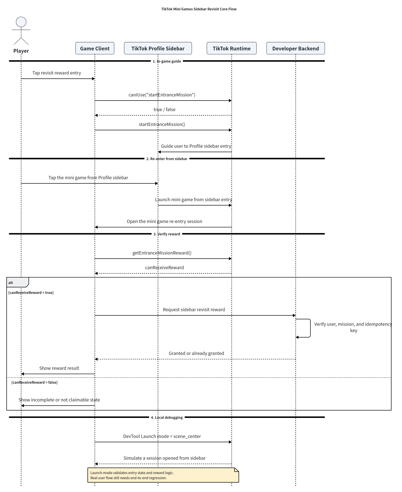
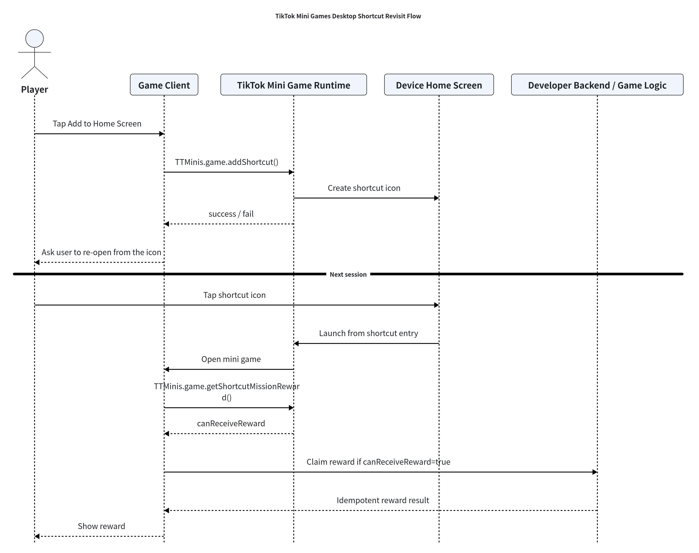

# Hướng dẫn sử dụng TikTok Unity SDK

!!! Các game Unity đã lên sóng trước ngày 5/3, có thể tải lên (upload) lại nền tảng và phát hành bản mới. Chúng tôi đã thêm một bản tối ưu hóa hiệu suất, cần phải tải lên lại thì mới kích hoạt được.

Trong quá trình thử nghiệm nội bộ (Beta), nếu tiện, và nếu tôi có trong nhóm hỗ trợ/trao đổi của mọi người, khi mọi người lên sóng game Unity có thể tag `@@user 1285` một chút. Việc này giúp chúng tôi dễ dàng trải nghiệm và chuẩn bị cho các tối ưu hóa tiếp theo.

Tài liệu hướng dẫn phát triển và tích hợp Mini Game tổng hợp: TikTok Mini Game All in One // Hướng dẫn tích hợp một cửa TikTok Mini Game 2.0

Đề xuất tối ưu hóa việc đóng gói (build) Unity Mini Game

Phiên bản Client !!! `<android,ios> >= 4310`

Phiên bản Unity cli: https://www.npmjs.com/package/@ttmg/cli/v/0.3.3

Quy trình chia gói (sub-package) wasmcode cho TikTok Unity Mini Game

!!! Nếu một số người dùng máy tính để bàn Windows phát hiện không thể kết nối gỡ lỗi (debug) với `ttmg dev`, hãy chạy lệnh sau trong dòng lệnh (cần quyền quản trị viên / Administrator):
`netsh advfirewall set allprofiles state off`

Giới hạn kích thước tải lên của gói game Unity là 60M. Để đảm bảo hiệu suất game, vui lòng cố gắng kiểm soát dung lượng file `data` và `wasm` ở mức nhỏ nhất có thể, nếu không sẽ ảnh hưởng đến việc chạy quảng cáo.

**Bắt đầu (Get Started)**

**Beta:** Trong thời gian thử nghiệm nội bộ, SDK dưới đây sẽ được cập nhật thường xuyên, vui lòng đảm bảo bạn đang dùng phiên bản mới nhất!!!

Unity SDK package (import SDK dưới đây vào project Unity của bạn):
[com.tiktok.minigame@1.0.37-Beta.unitypackage](./Package/com.tiktok.minigame@1.0.37-Beta.unitypackage)

**Release:**

Công cụ build (đóng gói):


Tải lên sản phẩm sau khi build:


Tải lên thư mục `tt-minigame` này.
Khuyến nghị chạy lệnh `ttmg dev` ở bên trong thư mục `tt-minigame`: Tải lên thông qua lệnh upload của cli.


---

## Danh mục C# API

### 1. Bắt đầu nhanh

#### 1.1 Khai báo Namespace
```csharp
using TTSDK;
```

#### 1.2 Khởi tạo SDK
```csharp
void Start()
{
    TT.InitSDK((code, env) =>
    {
        if (code == 0)
        {
            Debug.Log("Khởi tạo SDK thành công");
            // Sau bước này có thể gọi các API khác
        }
    });
}
```

### 2. Khởi tạo

#### 2.1 InitSDK
Khởi tạo TTSDK, bắt buộc phải hoàn thành khởi tạo trước khi gọi tất cả các API.
```csharp
TT.InitSDK((code, env) =>
{
    // code: Mã lỗi, 0 nghĩa là thành công
    // env: Thông tin môi trường container
    Debug.Log($"Khởi tạo hoàn tất, GameAppId: {env.GameAppId}");
});
```

**Giải thích mã lỗi:**

| Code | Mô tả |
| :--- | :--- |
| 0 | Không có lỗi |
| 1 | Phiên bản TT Unity SDK không được hỗ trợ |
| 2 | Phiên bản Unity Engine không được hỗ trợ |

#### 2.2 InContainerEnv
Kiểm tra xem có đang chạy trong môi trường thiết bị thực TT Container hay không.
```csharp
if (TT.InContainerEnv)
{
    Debug.Log("Đang chạy trên môi trường thiết bị thực");
}
else
{
    Debug.Log("Đang chạy trên trình chỉnh sửa (Editor) hoặc môi trường không phải container");
}
```

#### 2.3 s_ContainerEnv
Lấy thông tin môi trường container.
```csharp
ContainerEnv env = TT.s_ContainerEnv;
```

### 3. Thông tin phiên bản

#### 3.1 TTSDKVersion
Lấy số phiên bản TTSDK.
```csharp
string sdkVersion = TT.TTSDKVersion;
// Ví dụ: "6.5.5"
```

#### 3.2 GameVersion
Lấy số phiên bản game (thay thế cho Application.version).
```csharp
string gameVersion = TT.GameVersion;
```

#### 3.3 GamePublishVersion
Lấy số phiên bản phát hành game (số phiên bản được chỉ định trong công cụ phát hành).
```csharp
string publishVersion = TT.GamePublishVersion;
```

#### 3.4 GetContainerVersion
Lấy số phiên bản SDK container trên thiết bị (client).
```csharp
string containerVersion = TT.GetContainerVersion();
// Ví dụ: "1.0.0"
```

#### 3.5 GetLaunchOptionsSync
Lấy các tham số khi khởi động Mini Game.
```csharp
LaunchOption options = TT.GetLaunchOptionsSync();
Debug.Log($"Scene: {options.Scene}, Path: {options.Path}");
```
⚠️ **Lưu ý:** Các tham số có thể rỗng (null), cần kiểm tra null trước khi sử dụng; cần được gọi sau khi có callback từ InitSDK.

#### 3.6 GetSystemInfo
Lấy thông tin hệ thống.
```csharp
TTSystemInfo systemInfo = TT.GetSystemInfo();
Debug.Log(systemInfo.Serialize());
```

### 4. Đăng nhập tài khoản

#### 4.1 Login
Đăng nhập để lấy thông tin xác thực đăng nhập tạm thời (credential).
```csharp
TT.Login(
    successCallback: (code) =>
    {
        // code: Thông tin xác thực đăng nhập tạm thời, dùng để máy chủ (server) đổi lấy openid
        Debug.Log($"Đăng nhập thành công, code: {code}");
    },
    failedCallback: (errMsg) =>
    {
        Debug.Log($"Đăng nhập thất bại: {errMsg}");
    }
);
```
**Giải thích:**
- `code` có thể dùng để đổi lấy `openid` (định danh duy nhất của người dùng)
- `anonymousCode` có thể dùng để đổi lấy `anonymous_openid` (giống nhau trên cùng một thiết bị)

#### 4.2 Authorize
Gửi yêu cầu ủy quyền (authorize) tới người dùng từ trước.
```csharp
TT.Authorize(
    scope: "user.info.basic",
    success: (token, data) =>
    {
        Debug.Log($"Ủy quyền thành công, token: {token}");
    },
    fail: (errCode, errMsg) =>
    {
        Debug.Log($"Ủy quyền thất bại: {errCode}, {errMsg}");
    }
);
```
**Các Scope thường dùng:**
- `user.info.basic` - Thông tin người dùng cơ bản

### 5. Hệ thống thanh toán

#### 5.1 CheckBalance
Kiểm tra xem số dư (balance) của người dùng có đủ không.
```csharp
TT.CheckBalance(new TTCheckBalanceParam
{
    amount = 100,
    type = "BEANS",
    success = (data) =>
    {
        Debug.Log($"Số dư đủ: {data.is_sufficient}");
    },
    fail = (error) =>
    {
        Debug.Log($"Kiểm tra thất bại: {error}");
    }
});
```

#### 5.2 Recharge
Mở giao diện nạp tiền.
```csharp
TT.Recharge(new TTRechargeParam
{
    tier_id = "tier_100",
    success = (data) =>
    {
        Debug.Log("Nạp tiền thành công");
    },
    fail = (error) =>
    {
        Debug.Log($"Nạp tiền thất bại: {error}");
    }
});
```

#### 5.3 Pay
Khởi tạo thanh toán.
```csharp
TT.Pay(new TTPayParam
{
    trade_order_id = "order_" + DateTime.Now.Ticks,
    success = (data) =>
    {
        Debug.Log("Thanh toán thành công");
    },
    fail = (error) =>
    {
        Debug.Log($"Thanh toán thất bại: {error}");
    }
});
```

#### 5.4 NavigateToBalance
Chuyển hướng (nhảy) đến trang số dư.
```csharp
TT.NavigateToBalance(new TTNavigateToBalanceParam
{
    success = (data) =>
    {
        Debug.Log("Chuyển hướng thành công");
    },
    fail = (error) =>
    {
        Debug.Log($"Chuyển hướng thất bại: {error}");
    }
});
```

### 6. Nhiệm vụ lối vào — Quay lại qua Sidebar (Sidebar Revisit / Entrance Mission)

Sử dụng cơ chế **Quay lại qua Sidebar (Sidebar Revisit)** khi game của bạn muốn kéo người chơi quay trở lại sau phiên chơi đầu tiên hoặc các phiên chơi trước đó. Tính năng này đặc biệt phù hợp cho phần thưởng hàng ngày (daily rewards), hồi phục thể lực (energy recovery), chuỗi điểm danh đăng nhập (login streaks), nhiệm vụ sự kiện (event missions) và quà tặng trở lại (return gifts): game của bạn hướng dẫn người chơi tới thanh bên **TikTok Profile (Profile Sidebar)**, người chơi mở lại game từ thanh bên đó, và game sẽ kiểm tra xem phiên chơi vào lại này có đủ điều kiện nhận thưởng hay không.

Sidebar Revisit **không phải** là kênh thu hút người dùng mới (UA) và **không phải** là API chuyển hướng trong game để mở một Mini Game khác. Tính năng này chỉ giải quyết duy nhất một vấn đề: sau khi người dùng đã biết hoặc đã chơi game của bạn, làm thế nào để họ quay lại thông qua thanh bên TikTok Profile và nhận thưởng sau khi vào lại.

> **Trước khi tích hợp:** Tính khả dụng phụ thuộc vào phiên bản TikTok client, khu vực tài khoản, tiến độ triển khai của nền tảng (rollout) và thị trường mục tiêu. Hãy đảm bảo tài khoản kiểm thử nằm trong danh sách hỗ trợ, và luôn luôn thêm các bước kiểm tra bằng `canIUse` (hoặc `CanIUse`) cùng logic dự phòng (graceful fallback).

---

#### I. Tổng quan kỹ thuật (Technical Overview)

Luồng cốt lõi: **"Hướng dẫn sang sidebar $\rightarrow$ Mở lại từ sidebar $\rightarrow$ Xác thực phần thưởng $\rightarrow$ Trao thưởng ở phía nghiệp vụ"**. 
TikTok cung cấp lối vào trên thanh bên Profile và quản lý trạng thái nhiệm vụ. Mini Game thiết kế thời điểm kích hoạt, gọi API và xử lý trang khi người dùng quay lại. Developer Backend xử lý tính **Idempotency** (chống nhận trùng) và trao tài sản trong game.

**Bảng phân chia trách nhiệm:**

| Vai trò (Role) | Trách nhiệm (Responsibility) |
| :--- | :--- |
| **Game client** | Hiển thị lối vào/nút nhận thưởng quay lại, gọi `startEntranceMission`, gọi `getEntranceMissionReward` sau khi người dùng vào lại từ sidebar, và chuyển kết quả đủ điều kiện sang luồng nhận thưởng nghiệp vụ. |
| **Developer backend** | Duy trì cơ chế idempotent theo người dùng, nhiệm vụ, ngày hoặc số lần; xác thực tính hợp lệ của phần thưởng; trao xu, thể lực, vật phẩm, quyền lợi hoặc tiến độ nhiệm vụ; và ghi log nhận thưởng. |
| **TikTok platform** | Cung cấp lối vào trên thanh bên TikTok Profile, xử lý việc kích hoạt nhiệm vụ lối vào và trả về kết quả xem phiên chơi hiện tại có đủ điều kiện nhận thưởng hay không. |

> **Ranh giới quan trọng (Boundaries):**
> - Callback `startEntranceMission` thành công **chỉ có nghĩa là luồng hướng dẫn đã được kích hoạt**. Điều này **không có nghĩa là người dùng đã vào lại từ sidebar**, và **tuyệt đối không được dùng làm tín hiệu để trao thưởng**.
> - `getEntranceMissionReward` trả về việc phiên chơi hiện tại có khớp với điều kiện thưởng Sidebar Revisit hay không. API này **không tự động cộng tài sản** trong game.
> - Việc phát thưởng **bắt buộc phải idempotent** ở phía nghiệp vụ/backend; nếu không, thao tác bấm liên tục, mở lại nhiều lần hoặc đăng nhập nhiều thiết bị có thể gây trùng lặp phần thưởng.
> - Để làm tính năng phím tắt màn hình chính, hãy tham khảo [Mục 11 - Desktop Shortcut Revisit](#11-phím-tắt-màn-hình-chính-shortcut-revisit). Với các thẻ hiển thị trên Feed, hãy tham khảo tài liệu Direct Play Card.



---

#### II. Các bước thực hiện chính (Key Steps)

##### 1. Xác nhận tính khả dụng và kịch bản nhận thưởng
Trước khi triển khai, hãy xác nhận tài khoản test, khu vực, phiên bản TikTok client và tiến độ rollout có hỗ trợ Sidebar Revisit hay không. Sau đó định nghĩa lý do người dùng nên quay lại và họ sẽ nhận được phần thưởng gì:
1. Xác nhận tài khoản test nằm trong danh sách rollout hỗ trợ.
2. Xác nhận phiên bản TikTok client đạt yêu cầu (thường là $\ge 41.0.0$).
3. Thiết kế phần thưởng quay lại (xu hàng ngày, thể lực, tiến độ nhiệm vụ sự kiện, chuỗi đăng nhập hoặc quà trở lại).
4. Định nghĩa quy tắc Idempotent, ví dụ: `user + mission + date` hoặc `user + campaign + count`.

##### 2. Cung cấp lối vào rõ ràng trong game
Không chỉ gọi API trong code, hãy cung cấp một nút bấm/giao diện dễ hiểu trong game (ví dụ: *"Đến sidebar nhận thưởng"* hoặc *"Mở lại từ sidebar TikTok để nhận thể lực"*). Nội dung văn bản cần làm rõ rằng người chơi cần mở lại game từ thanh bên TikTok Profile thì phần thưởng mới có thể nhận được.

**Thời điểm khuyến nghị gợi ý người chơi:**
- Sau màn hướng dẫn tân thủ (Onboarding), để giúp người chơi biết lối vào quay lại game.
- Khi người chơi hết thể lực, hết xu hoặc hết lượt chơi.
- Tại trang điểm danh hàng ngày, trang sự kiện hoặc trung tâm phúc lợi.

##### 3. Kiểm tra tính khả dụng của API và cơ chế dự phòng (Fallback)
Luôn dùng `canIUse` (hoặc `CanIUse`) trước khi gọi API. Nếu không được hỗ trợ, tuyệt đối không gọi ép buộc mà hãy ẩn nút, hiển thị thông báo cập nhật TikTok hoặc hướng dẫn sang lối vào khác.

**Phiên bản JS:**
```javascript
const canStartSidebarMission = TTMinis.game.canIUse("startEntranceMission");
const canCheckSidebarReward = TTMinis.game.canIUse("getEntranceMissionReward");

if (!canStartSidebarMission || !canCheckSidebarReward) {
  // Ẩn lối vào nhận thưởng sidebar hoặc hiển thị UI dự phòng
}
```

**Phiên bản Unity / C#:**
```csharp
bool isSidebarSupported = CanIUse.StartEntranceMission && CanIUse.GetEntranceMissionReward;
sidebarMissionButton.SetActive(isSidebarSupported);
```

##### 4. Gọi `startEntranceMission` để hướng dẫn người dùng tới sidebar
Khi người dùng bấm nút trong game, gọi `startEntranceMission`. Callback `success` chỉ mang ý nghĩa là luồng hướng dẫn đã được bật lên, không có nghĩa là người chơi đã hoàn thành việc quay lại.

**Phiên bản JS:**
```javascript
function onClickGoSidebarMission() {
  if (!TTMinis.game.canIUse("startEntranceMission")) {
    return;
  }

  TTMinis.game.startEntranceMission({
    success: () => {
      // Hướng dẫn người dùng mở lại game từ thanh bên TikTok Profile
    },
    fail: (err) => {
      console.warn("[startEntranceMission] fail", err?.errorCode, err?.errMsg);
    },
    complete: () => {
      console.log("[startEntranceMission] complete");
    },
  });
}
```

**Phiên bản Unity / C#:**
```csharp
// Đối với Unity: Plugin Unity đăng ký bridge API nội bộ startEntranceMission và getEntranceMissionReward
// tương ứng với minis.startEntranceMission và minis.getEntranceMissionReward.
TT.StartEntranceMission(new TTStartEntranceMissionParam
{
    success = (data) =>
    {
        Debug.Log("Đã kích hoạt luồng hướng dẫn sang Sidebar TikTok Profile");
        _waitingEntranceMission = true; // Đánh dấu để kiểm tra ở OnShow khi quay lại
    },
    fail = (error) =>
    {
        Debug.LogWarning($"startEntranceMission thất bại: {error.ErrMsg}");
    },
    complete = (res) =>
    {
        Debug.Log("Yêu cầu startEntranceMission hoàn tất");
    }
});
```

##### 5. Gọi `getEntranceMissionReward` sau khi người dùng vào lại
Sau khi người dùng mở lại Mini Game từ thanh bên TikTok Profile, gọi `getEntranceMissionReward` tại thời điểm/trang phù hợp (thường gắn vào sự kiện `OnShow` của vòng đời ứng dụng). **Chỉ khi `canReceiveReward == true`** thì game mới tiến hành luồng nhận thưởng nghiệp vụ.

**Phiên bản JS:**
```javascript
function checkSidebarRevisitReward() {
  if (!TTMinis.game.getEntranceMissionReward) {
    return;
  }

  TTMinis.game.getEntranceMissionReward({
    success: ({ canReceiveReward }) => {
      if (canReceiveReward) {
        // Gọi backend của bạn để nhận thưởng
        claimSidebarReward();
      } else {
        // Thường do session hiện tại không khởi chạy từ đúng lối vào sidebar,
        // nhiệm vụ chưa hoàn thành, hoặc tài khoản chưa nằm trong danh sách hỗ trợ.
      }
    },
    fail: (err) => {
      console.warn("[getEntranceMissionReward] fail", err?.errorCode, err?.errMsg);
    },
  });
}
```

**Phiên bản Unity / C# (Tích hợp với App LifeCycle):**
```csharp
public class SidebarRevisitFlow : MonoBehaviour
{
    [SerializeField] private GameObject missionButton;
    private bool _waitingEntranceMission;

    public void Setup()
    {
        bool available = CanIUse.StartEntranceMission && CanIUse.GetEntranceMissionReward;
        missionButton.SetActive(available);
        if (!available) return;

        // Lắng nghe khi game quay lại foreground
        TT.GetAppLifeCycle().OnShow += (options) =>
        {
            if (_waitingEntranceMission)
            {
                _waitingEntranceMission = false;
                CheckSidebarReward();
            }
        };
    }

    public void OnButtonClick()
    {
        TT.StartEntranceMission(new TTStartEntranceMissionParam
        {
            success = _ => _waitingEntranceMission = true,
            fail = e => Debug.LogWarning($"Start fail: {e.ErrMsg}")
        });
    }

    private void CheckSidebarReward()
    {
        TT.GetEntranceMissionReward(new TTGetEntranceMissionRewardParam
        {
            success = (data) =>
            {
                if (data.canReceiveReward)
                {
                    Debug.Log("Đủ điều kiện — tiến hành cấp phần thưởng qua backend");
                    // ClaimRewardFromBackend();
                }
                else
                {
                    Debug.Log("Chưa hoàn thành nhiệm vụ sidebar hoặc session không hợp lệ");
                }
            },
            fail = (error) => Debug.LogWarning($"Kiểm tra thưởng thất bại: {error.ErrMsg}")
        });
    }
}
```

##### 6. Trao thưởng theo cơ chế Idempotent ở phía nghiệp vụ
Frontend không được tự ý cộng tài sản chỉ dựa vào việc bấm nút hoặc khi `startEntranceMission` thành công. Sau khi `canReceiveReward == true`, frontend gửi request lên Developer Backend, và Backend chỉ trao thưởng sau khi đã kiểm tra tính idempotent theo user, nhiệm vụ, ngày hoặc số lần.

**Ví dụ JS gọi Backend:**
```javascript
async function claimSidebarReward() {
  const result = await fetch("/api/revisit/sidebar/claim", {
    method: "POST",
    credentials: "include",
  }).then((res) => res.json());

  if (result.status === "granted" || result.status === "already_granted") {
    // Cập nhật lại xu, thể lực, vật phẩm hoặc trạng thái quyền lợi trên UI
  }
}
```

**Ví dụ về Idempotency Keys:**
- Thưởng hàng ngày: `open_id + sidebar_revisit + yyyyMMdd`
- Thưởng sự kiện: `open_id + campaign_id + mission_id`
- Thưởng theo số lần: `open_id + mission_id + claim_count`

##### 7. Xác thực riêng biệt giữa chế độ Launch Mode và luồng người dùng thật
Chế độ Launch Mode trong DevTool dùng để xác thực nhanh điều kiện lối vào và logic nhận thưởng. Luồng người dùng thật dùng để kiểm tra hướng dẫn, chuyển trang, vào lại và trải nghiệm tổng thể. Không dùng kết quả của phương pháp này để thay thế cho phương pháp kia.

**Bảng so sánh phương pháp kiểm thử:**

| Phương pháp kiểm thử (Validation method) | Cách kiểm tra (How to test) | Nội dung được xác thực (What it validates) |
| :--- | :--- | :--- |
| **DevTool Launch mode** | Chọn Sidebar Revisit / `scene_center`, quét mã QR mở game, sau đó gọi trực tiếp `getEntranceMissionReward`. | Điều kiện nguồn lối vào, cờ `canReceiveReward` và logic trao thưởng phía backend. |
| **Luồng người dùng thật (Real user flow)** | Mở game từ lối vào thông thường, bấm nút nhiệm vụ trong game, gọi `startEntranceMission`, và mở lại từ thanh bên TikTok Profile. | Trải nghiệm hướng dẫn người dùng, thao tác nhảy trang, đường dẫn mở lại, thông báo thưởng và toàn bộ trải nghiệm đầu-cuối. |

---

#### III. Các câu hỏi thường gặp (FAQ)

**Bảng tra cứu nhanh lỗi:**

| Điểm xảy ra lỗi (Failure point) | Hiện tượng phổ biến (Common symptom) | Kiểm tra trước tiên (Check first) |
| :--- | :--- | :--- |
| **Tính khả dụng** | Nút bị ẩn, API không có sẵn | Phiên bản TikTok, khu vực tài khoản, phạm vi rollout và kết quả `canIUse`. |
| **Hướng dẫn lối vào** | `startEntranceMission` thất bại | Kiểm tra tính khả dụng, mã lỗi (error code), rollout tài khoản, phiên bản client. |
| **Xác thực vào lại** | `canReceiveReward = false` | Xem session có thực sự vào lại từ thanh bên không; Launch mode có chọn `scene_center` chưa; phiên bản client và rollout. |
| **Phát thưởng** | Trùng thưởng hoặc mất thưởng | Idempotency key ở backend, định danh user, trạng thái nhiệm vụ và log phát thưởng. |

---

##### 1. Tại sao `canReceiveReward` là `true` trong Launch mode nhưng lại là `false` trong luồng người dùng thật?
Launch mode giả lập một phiên chơi đã được mở từ một lối vào cụ thể. Sau khi chọn Sidebar Revisit / `scene_center`, session hiện tại được coi là đã mở từ thanh bên, do đó `getEntranceMissionReward` có thể trả về `canReceiveReward = true` ngay lập tức.

Luồng người dùng thật lại hoàn toàn khác: Người chơi phải thực sự trải qua chuỗi hành động *"được hướng dẫn từ game sang thanh bên $\rightarrow$ mở lại game từ thanh bên"* thì session hiện tại mới đủ điều kiện.

*Khuyến nghị:* Debug riêng biệt 2 phần — dùng Launch mode để kiểm tra trạng thái lối vào và logic trao thưởng; dùng luồng người dùng thật để kiểm tra trải nghiệm hướng dẫn, chuyển trang và vào lại.

##### 2. Tại sao `canReceiveReward` vẫn là `false` sau khi đã vào lại từ thanh bên?
- Trước tiên, hãy xác nhận session hiện tại thực sự đến từ thanh bên TikTok Profile, chứ không phải quét mã QR, tìm kiếm, chia sẻ, quảng cáo, phím tắt màn hình chính hay lối vào nào khác.
- Nếu nguồn lối vào đúng, tiếp tục kiểm tra phiên bản TikTok client, khu vực tài khoản, trạng thái rollout, trạng thái nhiệm vụ và mã lỗi API.
- Nếu chỉ lỗi trên một nền tảng (ví dụ: Android chạy được nhưng iOS bị lỗi), hãy cung cấp thông tin nền tảng, phiên bản TikTok, phiên bản OS, đường dẫn lối vào và toàn bộ log callback API.

##### 3. Tại sao người chơi không nhận được thưởng ngay sau khi `startEntranceMission` thành công?
`startEntranceMission` thành công **chỉ có nghĩa là luồng hướng dẫn đã được kích hoạt**, không có nghĩa là người chơi đã hoàn thành việc quay lại từ thanh bên.

Việc xác thực thưởng phải diễn ra sau khi người chơi mở lại game từ thanh bên, và kết quả phải dựa trên `getEntranceMissionReward.canReceiveReward`. Tuyệt đối không phát thưởng trong callback `startEntranceMission.success`.

##### 4. Tôi nên làm gì nếu `startEntranceMission` thất bại?
- Gọi `canIUse("startEntranceMission")` (hoặc `CanIUse.StartEntranceMission`) trước. Nếu không hỗ trợ, client/tài khoản/môi trường hiện tại chưa hỗ trợ tính năng này $\rightarrow$ Hãy ẩn nút hoặc dùng UI dự phòng.
- Nếu `canIUse` trả về `true` nhưng gọi vẫn lỗi, hãy ghi lại `errorCode`, `errMsg`, phiên bản app TikTok, phiên bản OS, khu vực tài khoản, nguồn khởi chạy và các bước tái hiện lỗi để tiếp tục chẩn đoán.

##### 5. Phần thưởng nên do Frontend hay Backend cấp phát?
Frontend chỉ hiển thị kết quả phần thưởng, việc xác thực điều kiện và **cộng tài sản bắt buộc phải do Developer Backend xử lý**. Người chơi có thể bấm nhiều lần, vào lại nhiều lần, chuyển đổi trạng thái app hoặc kích hoạt nhiệm vụ từ nhiều thiết bị. Nếu không có cơ chế idempotent ở backend, tài sản trong game có thể bị cấp phát trùng lặp.

##### 6. Sidebar Revisit khác gì so với Desktop Shortcut hay History Played Card?
Tất cả đều là các kênh kéo người chơi quay lại, nhưng **nguồn lối vào và API xác thực hoàn toàn khác nhau**:
- **Sidebar Revisit:** Người chơi vào lại từ thanh bên TikTok Profile, dùng `startEntranceMission` và `getEntranceMissionReward`.
- **Desktop Shortcut Revisit:** Người chơi vào lại từ icon trên màn hình chính, dùng `addShortcut` và `getShortcutMissionReward`.
- **Direct Play Card / History Played Card:** Khả năng hiển thị quay lại trên trang Feed TikTok. Không tái sử dụng API xác thực của sidebar cho tính năng này.
Tuyệt đối không dùng chung launch mode, tham số lối vào hoặc API nhận thưởng giữa các cơ chế này.

##### 7. Tại sao cùng một đoạn code lại chạy được trên Android nhưng không chạy được trên iOS?
Đây thường không phải lỗi code frontend đơn thuần. Hãy tiếp tục kiểm tra phiên bản TikTok trên iOS, phiên bản iOS, khu vực tài khoản, trạng thái rollout, các trường tham số lối vào và việc client đã thích ứng với giao diện thanh bên mới nhất hay chưa.

Khi cần hỗ trợ, hãy cung cấp rõ nền tảng, phiên bản TikTok, phiên bản OS, xác nhận session có đúng từ sidebar không, toàn bộ response từ `getEntranceMissionReward`, thời điểm lỗi và `log_id`. Việc chỉ báo "Android được, iOS không được" là không đủ để chẩn đoán.

##### 8. Cần cung cấp những thông tin gì khi cần phía nền tảng hỗ trợ xử lý sự cố?
Cung cấp đầy đủ các thông tin sau:
- App ID / Client Key.
- Khu vực tài khoản test, phiên bản ứng dụng TikTok, nền tảng thiết bị và phiên bản OS.
- Phương pháp kiểm thử: DevTool Launch mode hay luồng người dùng thật.
- Nếu dùng Launch mode, có chọn `scene_center` hay không.
- Toàn bộ dữ liệu callback của `startEntranceMission` và `getEntranceMissionReward` (bao gồm `errorCode`, `errMsg`, `canReceiveReward`).
- Ảnh chụp hoặc video màn hình thể hiện lối vào khởi chạy game.
- Request nhận thưởng và log idempotent ở phía backend của bạn.

---

#### 6.4 ShowRevisitGuide — cơ chế quay lại thứ hai (chưa gọi được)

SDK có sẵn lớp public `TTSDK.TTFavorite` với `ShowRevisitGuide(Action<bool> callback)` (WebGL method `showRevisitGuide`, yêu cầu **container ≥ 6.2.0**) — hiện bong bóng hướng dẫn quay lại **ngay trong game**, khác hẳn `StartEntranceMission` là chuyển người chơi ra ngoài sidebar. Cùng nhóm: `Collect` / `CancelCollection` / `IsCollected` / `ShowFavoriteGuide` (container ≥ 3.3). `CanIUse.ShowRevisitGuide` và `CanIUse.ShowFavoriteGuide` cũng đã có.

**Nhưng chưa dùng được:** accessor duy nhất là `ITTAPI.GetTTFavorite()`, mà `ITTAPI` là interface `private` và `TT.TTInner` có access modifier `assembly` (internal) → code game **không lấy được instance `TTFavorite`**. Đã kiểm chứng bằng cách dịch ngược `ttsdk.dll` trên **cả 1.0.37-Beta** (gói trong repo này) **và 1.1.3-Release** (bản game `leftright1` đang dùng). Nếu cần tính năng này phải xin TikTok bản SDK expose public hoặc chờ bản mới.

### 7. Vòng đời Game

#### 7.1 GetAppLifeCycle
Lấy trình quản lý vòng đời ứng dụng.
```csharp
TTAppLifeCycle lifeCycle = TT.GetAppLifeCycle();

// Lắng nghe sự kiện hiển thị (Show)
lifeCycle.OnShow += (options) =>
{
    Debug.Log("Game vào chế độ foreground (tiền cảnh)");
};

// Lắng nghe sự kiện ẩn (Hide)
lifeCycle.OnHide += () =>
{
    Debug.Log("Game vào chế độ background (nền)");
};
```

#### 7.2 SetOnBeforeExitAppListener (Không hỗ trợ)
Lắng nghe sự kiện thoát game.
```csharp
TT.SetOnBeforeExitAppListener(() =>
{
    // Trả về true: Nhà phát triển tự xử lý logic thoát, có thể gọi TT.ExitMiniProgram() để thoát thủ công
    // Trả về false: Thoát game theo mặc định
    Debug.Log("Game sắp thoát");
    return false;
});
```

### 8. Hệ thống tập tin (File System)

#### 8.1 GetFileSystemManager
Lấy trình quản lý hệ thống tập tin.
```csharp
TTFileSystemManager fsManager = TT.GetFileSystemManager();
```

#### 8.2 CleanAllFileCache
Dọn dẹp tất cả bộ nhớ đệm (cache) tập tin.
```csharp
TT.CleanAllFileCache((success) =>
{
    Debug.Log($"Dọn dẹp cache: {(success ? "Thành công" : "Thất bại")}");
});
```

### 9. Lưu trữ dữ liệu

#### 9.1 PlayerPrefs
Nên dùng `using PlayerPrefs = TT.PlayerPrefs;`. Việc dùng `PlayerPrefs` có sẵn của Unity sẽ dẫn đến việc lưu trữ dữ liệu bền vững (persistent) bị thất bại.
Lưu trữ key-value hạng nhẹ (tương tự như `PlayerPrefs` của Unity). Hàm `HasKey` chưa được thực hiện.
```csharp
// Lưu trữ dữ liệu
TT.PlayerPrefs.SetInt("score", 100);
TT.PlayerPrefs.SetFloat("volume", 0.8f);
TT.PlayerPrefs.SetString("playerName", "Player1");

// Đọc dữ liệu
int score = TT.PlayerPrefs.GetInt("score");
float volume = TT.PlayerPrefs.GetFloat("volume");
string name = TT.PlayerPrefs.GetString("playerName");
```

#### 9.2 Save
Lưu dữ liệu game (hỗ trợ đối tượng phức tạp, giới hạn tối đa 50MB).
```csharp
// 1. Định nghĩa class lưu trữ có thể Serialize
[Serializable]
public class SaveData
{
    public int level = 1;
    public float progress = 0f;
    public string playerName = "";
    public List<string> items = new List<string>();
    public Dictionary<string, bool> achievements = new Dictionary<string, bool>();
}

// 2. Lưu dữ liệu
SaveData data = new SaveData 
{ 
    level = 10, 
    progress = 0.75f,
    playerName = "Hero"
};
bool saved = TT.Save(data, "my_save");
Debug.Log($"Lưu: {(saved ? "Thành công" : "Thất bại")}");
```

#### 9.3 LoadSaving
Tải (load) dữ liệu game.
```csharp
SaveData loaded = TT.LoadSaving<SaveData>("my_save");
if (loaded != null)
{
    Debug.Log($"Level đã tải: {loaded.level}");
}
```

#### 9.4 DeleteSaving
Xóa file lưu (save) được chỉ định.
```csharp
TT.DeleteSaving<SaveData>("my_save");
```

#### 9.5 ClearAllSavings
Xóa tất cả dữ liệu lưu (save).
```csharp
TT.ClearAllSavings();
```

#### 9.6 GetSavingDiskSize
Lấy tổng dung lượng của dữ liệu lưu trữ (save).
```csharp
long size = TT.GetSavingDiskSize();
Debug.Log($"Dung lượng save: {size} bytes ({size / 1024f:F2} KB)");
```

### 10. Khả năng mạng (Network Capabilities)

#### 10.1 GetNetWorkType
Lấy loại mạng hiện tại.
```csharp
TT.GetNetWorkType(new GetNetworkTypeParam
{
    Success = (result) =>
    {
        // Các giá trị có thể trả về: wifi, 2g, 3g, 4g, 5g, none, unknown
        Debug.Log($"Loại mạng: {result.NetworkType}");
    },
    Fail = (error) =>
    {
        Debug.Log($"Lấy thông tin mạng thất bại: {error}");
    }
});
```

#### 10.2 OnNetworkStatusChange
Lắng nghe sự thay đổi trạng thái mạng.
```csharp
TT.OnNetworkStatusChange((result) =>
{
    Debug.Log($"Mạng thay đổi: isConnected={result.IsConnected}, type={result.NetworkType}");
});
```

#### 10.3 OffNetworkStatusChange
Hủy lắng nghe sự thay đổi trạng thái mạng.
```csharp
// Hủy tất cả các lắng nghe
TT.OffNetworkStatusChange();

// Hoặc hủy một callback được chỉ định
TT.OffNetworkStatusChange(myCallback);
```

#### 10.4 OnNetworkWeakChange
Lắng nghe sự thay đổi trạng thái mạng yếu.
```csharp
TT.OnNetworkWeakChange((result) =>
{
    if (result.WeakNet)
    {
        Debug.Log("Mạng hiện tại khá yếu, khuyến nghị giảm chất lượng đồ họa");
    }
});
```

#### 10.5 OffNetworkWeakChange
Hủy lắng nghe sự thay đổi trạng thái mạng yếu.
```csharp
TT.OffNetworkWeakChange();
```

### 11. Phím tắt màn hình chính (Shortcut Revisit)

Sử dụng cơ chế **Quay lại qua phím tắt màn hình chính (Desktop Shortcut Revisit)** khi game của bạn cần cải thiện tỷ lệ giữ chân (retention), nhiệm vụ hàng ngày (daily tasks), hồi phục thể lực (energy recovery), chuỗi điểm danh đăng nhập (login streaks), tỷ lệ giữ chân ngày đầu (first-day retention) hoặc kéo người chơi quay lại sau các chiến dịch thu hút người dùng (UA). Tính năng này cho phép người chơi thêm lối tắt của Mini Game vào màn hình chính của thiết bị và mở lại game chỉ bằng một cú chạm.

Nếu game của bạn chỉ là trải nghiệm chơi một lần (one-time experience) và không phụ thuộc vào phần thưởng quay lại, lưu trữ dữ liệu, hệ thống nhiệm vụ hay vận hành lâu dài, bạn có thể tạm hoãn việc tích hợp tính năng này. Ngoài ra, **Desktop Shortcut** hoàn toàn khác với **Sidebar Revisit (Quay lại qua thanh bên)**, **Thẻ lịch sử đã chơi (History Played Card)** và **Thẻ chơi trực tiếp (Direct Play Card)**. Nguồn lối vào (entry source) và điều kiện kiểm tra thưởng của các tính năng này không được gộp chung hay nhầm lẫn với nhau.

---

#### I. Tổng quan kỹ thuật (Technical Overview)

Luồng cốt lõi bao gồm:
1. Hướng dẫn người dùng thêm Mini Game vào màn hình chính.
2. Người dùng thoát game và mở lại game từ icon trên màn hình chính.
3. Game kiểm tra xem phiên chơi (session) hiện tại có thỏa mãn điều kiện nhận thưởng quay lại qua phím tắt hay không.
4. Phía logic nghiệp vụ/server game tiến hành trao thưởng theo cơ chế **idempotent** (đảm bảo không trùng lặp khi nhận lại).



**Bảng phân chia trách nhiệm:**

| Vai trò (Role) | Trách nhiệm (Responsibility) |
| :--- | :--- |
| **Game client** | Hiển thị nút/lối vào thêm shortcut, gọi `addShortcut`, gọi `getShortcutMissionReward` sau khi người dùng vào lại game từ shortcut, và chỉ tiến hành nhận thưởng khi `canReceiveReward == true`. |
| **TikTok runtime** | Kích hoạt chức năng shortcut, xác định xem session hiện tại có đến từ lối tắt màn hình chính hay không, và trả về kết quả đủ điều kiện nhận thưởng. |
| **Developer backend / Game logic** | Quản lý sổ cái phần thưởng game và phát thưởng theo cơ chế idempotent. Việc nền tảng xác nhận đủ điều kiện (eligibility) không đồng nghĩa với việc phần thưởng nghiệp vụ đã được trao. |

> **Ranh giới quan trọng:**
> - Callback `addShortcut.success` **chỉ có nghĩa là luồng thêm shortcut đã được kích hoạt thành công**. Điều này **không có nghĩa là người dùng đã vào lại từ shortcut**, và **tuyệt đối không được trao thưởng ngay tại đây**.
> - `getShortcutMissionReward` dùng để kiểm tra xem session hiện tại có khớp với điều kiện thưởng khi quay lại qua shortcut hay không.
> - Tính năng giả lập `scene_shortcut` trong DevTool dùng để mô phỏng "đã khởi chạy từ lối tắt shortcut"; rất hữu ích để debug điều kiện và logic nhận thưởng, nhưng **không thể thay thế việc kiểm thử thực tế đầu-cuối (end-to-end)** từ icon trên màn hình chính của thiết bị thật.

---

#### II. Các bước thực hiện chính (Key Steps)

##### 1. Xác định xem game của bạn có cần thưởng quay lại qua shortcut hay không
Xác định mục tiêu nghiệp vụ trước: thưởng cho lần thêm đầu tiên, thưởng quay lại hàng ngày, thưởng chuỗi đăng nhập, hồi thể lực, tặng vật phẩm hay kích thích quay lại chơi thường xuyên. Xác định rõ khi nào có thể nhận thưởng, được nhận bao nhiêu lần, chỉ áp dụng cho lần đầu hay lặp lại, và đảm bảo tách biệt với phần thưởng Sidebar Revisit.

##### 2. Kiểm tra tính khả dụng của API và cơ chế dự phòng (Fallback)
- **Đối với C# / Unity:** `TT.AddShortcut` sẽ trả về thất bại nếu môi trường container không hỗ trợ. Hãy chuẩn bị UI dự phòng và ghi log đầy đủ. Bạn cũng có thể dùng `CanIUse.AddShortcut` để kiểm tra trước và ẩn nút nếu không hỗ trợ.
- **Đối với JS:** Gọi `TTMinis.game.canIUse('addShortcut')` trước khi hiển thị hoặc gọi tính năng. Nếu không hỗ trợ, ẩn lối vào hoặc nhắc người dùng cập nhật TikTok.
- *Yêu cầu phiên bản:* Khuyến nghị test trên TikTok client **≥ 41.0.0** (iOS yêu cầu **≥ 41.40**); tính khả dụng thực tế dựa theo kết quả kiểm tra runtime trên client.

```javascript
// JS Example
function canShowAddShortcutEntry() {
  return TTMinis.game.canIUse('addShortcut');
}
```

```csharp
// Unity C# Example
bool isShortcutSupported = CanIUse.AddShortcut && CanIUse.GetShortcutMissionReward;
addShortcutButton.gameObject.SetActive(isShortcutSupported);
```

##### 3. Cung cấp lối vào thêm shortcut rõ ràng trong game
Nội dung văn bản (copywriting) cần giải thích rõ cả **hành động** lẫn **điều kiện nhận thưởng**. Ví dụ: *"Thêm ra Màn hình chính. Mở lại từ icon vào ngày mai để nhận thưởng nhé."* Không được gây hiểu nhầm rằng chỉ cần bấm nút hoặc gọi `addShortcut` thành công là sẽ nhận thưởng ngay.

##### 4. Gọi addShortcut để hướng dẫn người dùng thêm icon

**Phiên bản Unity / C#:**
```csharp
// Chữ ký phương thức Callback trực tiếp
TT.AddShortcut(
    csCallback: (success) =>
    {
        Debug.Log($"Create shortcut: {(success ? "success" : "failed")}");
        // Thành công ở đây chỉ có nghĩa là luồng tạo shortcut đã được kích hoạt.
        // Tuyệt đối KHÔNG trao thưởng tại đây!
    }
);

// Hoặc gọi thông qua Param struct (nếu dùng giao thức Param)
/*
TT.AddShortcut(new AddShortcutParam
{
    success = () => Debug.Log("Kích hoạt tạo shortcut thành công"),
    fail = (error) => Debug.LogWarning($"Tạo shortcut thất bại: {error.ErrMsg}"),
    complete = () => Debug.Log("Yêu cầu hoàn tất")
});
*/
```

**Phiên bản JS:**
```javascript
function onClickAddShortcut() {
  if (!TTMinis.game.canIUse('addShortcut')) {
    // Không hỗ trợ: ẩn lối vào hoặc nhắc người dùng nâng cấp
    return;
  }

  TTMinis.game.addShortcut({
    success: () => {
      // Hướng dẫn người dùng kiểm tra icon và mở lại từ màn hình chính
    },
    fail: (e) => {
      console.warn('[addShortcut] fail', e?.errorCode, e?.errMsg);
    },
  });
}
```

##### 5. Kiểm tra phần thưởng sau khi người dùng vào lại từ shortcut
Việc kiểm tra thưởng **phải diễn ra sau khi người dùng mở lại Mini Game từ icon trên màn hình chính thiết bị**. Tuyệt đối không gọi và trao thưởng ngay trong cùng một session vừa bấm `addShortcut.success`.

**Phiên bản Unity / C#:**
```csharp
TT.GetShortcutMissionReward(new GetShortcutMissionRewardParam
{
    Success = (result) =>
    {
        if (result.CanReceiveReward) // hoặc result.canReceiveReward tùy phiên bản SDK
        {
            Debug.Log("Người dùng đủ điều kiện nhận phần thưởng shortcut");
            // Tiến hành luồng nhận thưởng. Việc phát thưởng bắt buộc phải idempotent!
        }
        else
        {
            Debug.Log("Người dùng tạm thời chưa đủ điều kiện nhận thưởng shortcut");
        }
    },
    Fail = (error) =>
    {
        Debug.LogWarning($"Lấy thông tin thưởng shortcut thất bại: {error.ErrMsg}");
    },
    Complete = () =>
    {
        Debug.Log("Yêu cầu kiểm tra thưởng shortcut hoàn tất");
    }
});
```

**Phiên bản JS:**
```javascript
function checkShortcutReward() {
  TTMinis.game.getShortcutMissionReward({
    success: (res) => {
      if (res?.canReceiveReward) {
        // Thực hiện luồng nhận thưởng. Phát thưởng bắt buộc phải idempotent!
      } else {
        // Thường là do session hiện tại không mở từ icon shortcut hoặc chưa đạt điều kiện nhiệm vụ
      }
    },
    fail: (e) => {
      console.warn('[getShortcutMissionReward] fail', e?.errorCode, e?.errMsg);
    },
  });
}
```

##### 6. Trao phần thưởng theo cơ chế Idempotent ở phía nghiệp vụ
Frontend có thể hiển thị trạng thái phần thưởng, nhưng không được coi là sổ cái lưu trữ cuối cùng. Developer Backend hoặc logic game đáng tin cậy phải ghi nhận trạng thái nhận thưởng với một **idempotency key** duy nhất (ví dụ: `open_id + mission_id + date/count`), đảm bảo việc mở lại nhiều lần, bấm liên tục hoặc chuyển đổi thiết bị không gây ra lỗi phát thưởng trùng lặp.

##### 7. Xác thực riêng biệt giữa chế độ Launch Mode và luồng người dùng thật
- **Launch Mode (trong DevTool):** Dùng để debug nhanh điều kiện nguồn lối vào và logic nhận thưởng. Khi chọn `scene_shortcut`, DevTool sẽ giả lập *"session hiện tại đến từ lối tắt shortcut"*, do đó cờ `canReceiveReward` có thể trả về `true` ngay lập tức.
- **Kiểm thử luồng người dùng thật:** Cần thực hiện đầy đủ các bước: Vào game từ lối vào thông thường $\rightarrow$ Bấm Thêm ra màn hình chính $\rightarrow$ Thoát session hiện tại $\rightarrow$ Mở lại từ icon trên màn hình chính $\rightarrow$ Gọi `getShortcutMissionReward` $\rightarrow$ Kiểm tra việc trao thưởng.
  - Vượt qua kiểm thử ở Launch Mode không đảm bảo luồng thực tế hoạt động trơn tru.
  - Ngược lại, nếu luồng thực tế thất bại chưa chắc là do logic nhận thưởng sai.

> ⚠️ **Đặc biệt quan trọng:** Shortcut trên màn hình chính luôn mở **phiên bản game đã phát hành chính thức (Online/Production version)**. Nếu Mini Game chưa từng phát hành bản Production nào, shortcut tạo từ bản Preview hoặc bản Local Debugging sẽ **không thể mở được bản Preview/Debug đó từ icon màn hình chính**.
> - Trong quá trình phát triển & debug: Hãy dùng `scene_shortcut` trên DevTool để xác thực điều kiện lối vào và logic trao thưởng.
> - Chỉ kiểm thử luồng shortcut thật trên thiết bị sau khi game đã phát hành ít nhất một phiên bản Production.

##### 8. Checklist kiểm tra trước khi phát hành (Release Checklist)
- [ ] Có phương án xử lý dự phòng (fallback) khi thiết bị không hỗ trợ `addShortcut`.
- [ ] Các callback lỗi của `addShortcut` và `getShortcutMissionReward` đều được theo dõi (log rõ thông báo lỗi, nền tảng thiết bị, phiên bản TikTok).
- [ ] Dưới chế độ `scene_shortcut` (DevTool), cờ `canReceiveReward` và logic trao thưởng hoạt động đúng kỳ vọng.
- [ ] Luồng mở lại từ icon màn hình chính trên thiết bị thật đã được xác thực trên App đã phát hành phiên bản Production.
- [ ] Các lối vào khác (không phải shortcut) không bị trao nhầm thưởng.
- [ ] Việc phát thưởng ở phía nghiệp vụ đảm bảo tuyệt đối tính **Idempotent** (chống nhận trùng lặp).

---

#### III. Các câu hỏi thường gặp (FAQ)

**Bảng tra cứu nhanh lỗi:**

| Vị trí lỗi (Where it fails) | Hiện tượng (Symptom) | Kiểm tra trước tiên (Check first) |
| :--- | :--- | :--- |
| **Thêm shortcut** | `addShortcut` thất bại hoặc không có hiện tượng gì | Kiểm tra `canIUse`, phiên bản TikTok, quyền hạn hệ thống và callback thất bại (`fail`). |
| **Kiểm tra thưởng** | `canReceiveReward = false` | Xác nhận người chơi có thực sự vào lại từ icon màn hình chính hay không, hoặc kiểm tra xem đã chọn `scene_shortcut` trong Launch mode chưa. |
| **Vào lại thực tế** | Bản Preview hoặc bản Local Debug không mở được từ icon màn hình chính sau khi thêm shortcut | Xác nhận xem Mini Game đã phát hành phiên bản Production (chính thức) chưa; lối vào shortcut **chỉ mở bản online**. |
| **Phát thưởng** | Trùng lặp hoặc thất lạc phần thưởng | Kiểm tra idempotency key của nghiệp vụ, trạng thái nhận thưởng (claim state) và log phía backend. |
| **Xử lý sự cố nền tảng** | Cùng một đoạn code nhưng hành vi khác nhau giữa các thiết bị | Cung cấp thông tin thiết bị, hệ điều hành (OS), phiên bản TikTok, video ghi lại lối vào, callback và `log_id`. |

---

##### 1. Tại sao `getShortcutMissionReward` vẫn trả về `false` ngay sau khi `addShortcut` thành công?
`addShortcut` thành công **chỉ có nghĩa là luồng tạo lối tắt đã được kích hoạt**. Điều này không có nghĩa là phiên chơi (session) hiện tại đến từ lối vào shortcut trên màn hình chính.

`getShortcutMissionReward` dùng để kiểm tra xem lần khởi chạy Mini Game này có xuất phát từ icon trên màn hình chính hay không. Luồng đúng là: Gọi `addShortcut` $\rightarrow$ Để người dùng thoát phiên chơi hiện tại $\rightarrow$ Người dùng mở lại Mini Game từ icon trên màn hình chính của thiết bị $\rightarrow$ Lúc này mới gọi `getShortcutMissionReward`. Nếu gọi ngay lập tức trong cùng phiên chơi đó, kết quả sẽ luôn trả về `false`, kể cả đối với tài khoản mới.

##### 2. Tại sao `canReceiveReward` là `true` trong Launch mode nhưng lại là `false` trong luồng người dùng thật?
Lựa chọn `scene_shortcut` trong DevTool chỉ là một **công cụ giả lập nguồn lối vào** nhằm giúp kiểm tra nhanh điều kiện shortcut và logic nhận thưởng. Nó không đồng nghĩa với việc người dùng đã thực sự hoàn thành việc thêm shortcut, thoát ra và mở lại từ icon màn hình chính.

Hãy kiểm thử luồng thực tế một cách độc lập. Nếu luồng thực tế thất bại, trước tiên hãy kiểm tra xem người dùng có thực sự bấm vào icon trên màn hình chính hay không, phiên bản TikTok có hỗ trợ tính năng này không và phiên chơi có bị tính nhầm là vào từ quét mã QR hoặc lối vào khác hay không.

##### 3. Tại sao tôi không thể mở Mini Game từ icon màn hình chính sau khi thêm từ bản Preview hoặc bản Local Debugging?
Đây là giới hạn luồng hiện tại của nền tảng: **Phím tắt trên màn hình chính chỉ mở phiên bản đã phát hành chính thức (Online/Production version) của Mini Game**, không mở bản Local Debugging hay bản Preview.

Nếu Mini Game chưa từng phát hành bản Production nào, shortcut tạo từ bản Preview hoặc Local Debug sẽ không thể mở được bản Preview/Debug đó từ icon màn hình chính (có thể gặp hiện tượng không mở được, bị đứng hoặc tải thất bại).

*Giải pháp:* Trong quá trình phát triển/debug, hãy sử dụng `scene_shortcut` trên DevTool để xác thực `getShortcutMissionReward` và logic trao thưởng. Luồng shortcut thật trên thiết bị chỉ nên được kiểm thử sau khi game đã có ít nhất một phiên bản Production. Nếu đã có bản Production, cần nhớ rằng icon sẽ mở bản online, nên không thể dùng nó để kiểm tra các thay đổi code mới của bản preview.

##### 4. Tại sao `canReceiveReward` vẫn là `false` kể cả khi tôi đã mở lại từ icon trên màn hình chính?
- Trước tiên, hãy xác nhận icon đó được tạo bởi `addShortcut` của chính Mini Game này, chứ không phải bookmark trình duyệt, lối vào cũ hoặc lối vào của ứng dụng khác.
- Kiểm tra phiên bản ứng dụng TikTok, nền tảng (Android/iOS), khu vực tài khoản và tính khả dụng của tính năng ở thời điểm hiện tại.
- Kiểm tra xem phần thưởng của nhiệm vụ này đã được nhận trước đó ở phía nghiệp vụ hay chưa. Tính hợp lệ từ nền tảng không thay thế cho sổ cái lưu trữ phần thưởng; trạng thái đã nhận thưởng vẫn cần được quản lý bởi logic nghiệp vụ của bạn.

##### 5. Tôi nên làm gì nếu `addShortcut` thất bại?
- Gọi `canIUse('addShortcut')` (hoặc `CanIUse.AddShortcut`) trước. Nếu không hỗ trợ, hãy ẩn lối vào hoặc nhắc người dùng nâng cấp ứng dụng.
- Nếu được hỗ trợ nhưng vẫn thất bại, hãy ghi lại `errorCode`, `errMsg`, nền tảng thiết bị, phiên bản hệ điều hành, phiên bản TikTok và quay video màn hình để tiếp tục chẩn đoán nguyên nhân (do giới hạn hệ thống, người dùng bấm Hủy hay lỗi tính năng từ phía client).

##### 6. Làm thế nào để reset trạng thái `canReceiveReward` để kiểm thử nhiều lần?
Hiện tại **không có API công khai nào để xóa hoặc reset trạng thái `canReceiveReward` từ phía nền tảng**.

Để kiểm thử nhiều lần:
- Khi cần thiết, hãy sử dụng tài khoản test hoặc thiết bị khác, và đảm bảo mỗi lần kiểm thử đều khởi chạy Mini Game từ icon màn hình chính thật.
- Trạng thái nhận thưởng của game cần do backend của bạn quản lý; trong quá trình test, bạn có thể xóa các bản ghi nhận thưởng test trong cơ sở dữ liệu backend của mình.

##### 7. Desktop Shortcut, Sidebar Revisit và History Played Card có thể dùng chung một logic kiểm tra thưởng không?
**Không khuyến nghị.**
- **Desktop Shortcut** sử dụng `addShortcut` / `getShortcutMissionReward`.
- **Sidebar Revisit** sử dụng `startEntranceMission` / `getEntranceMissionReward`.
- **History Played Card** hoặc **Direct Play Card** thuộc về cơ chế hiển thị quay lại trên Feed.

Nguồn lối vào và API trả thưởng của các cơ chế này hoàn toàn khác nhau. Việc gộp chung chúng thường dẫn đến việc `canReceiveReward = false` hoặc trao sai phần thưởng.

##### 8. Phần thưởng nên được cấp phát từ phía Frontend hay Backend?
Frontend chỉ nên hiển thị trạng thái phần thưởng, còn việc **phát tài sản/vật phẩm cuối cùng bắt buộc phải do Developer Backend hoặc logic nghiệp vụ đáng tin cậy xử lý**. Người chơi có thể vào lại nhiều lần, bấm liên tục hoặc kích hoạt cùng một nhiệm vụ từ nhiều thiết bị khác nhau. Nếu không có cơ chế **Idempotency (chống trùng lặp)**, xu, thể lực, vật phẩm hoặc quyền lợi có thể bị cấp phát nhiều lần.

##### 9. Cần cung cấp những thông tin gì khi cần phía nền tảng hỗ trợ xử lý sự cố?
Hãy cung cấp:
- App ID / Client Key
- Khu vực của tài khoản test
- Phiên bản ứng dụng TikTok
- Nền tảng thiết bị và phiên bản hệ điều hành (OS)
- Có đang sử dụng `scene_shortcut` hay không
- Video quay lại toàn bộ luồng vào game thực tế
- Toàn bộ dữ liệu callback trả về từ `addShortcut` và `getShortcutMissionReward`
- Thời điểm xảy ra lỗi, `log_id`
- Log phát thưởng / idempotency log ở phía backend của bạn.

### 12. Chia sẻ xã hội (Social Share)

#### 12.1 ShareAppMessage
Chủ động gọi giao diện chia sẻ, chuyển đến màn hình chọn danh bạ.
```csharp
TT.ShareAppMessage(new ShareAppMessageParam
{
    ImageUrl = "https://example.com/image.jpg",  // Địa chỉ hình ảnh chia sẻ
    Subtitle = "Tiêu đề phụ",                           // Tiêu đề phụ
    TemplateType = 1,                             // Kiểu mẫu template: 1 hoặc 2
    Title = "Tiêu đề chính",                             // Tiêu đề chính
    Path = "a/b",                                 // Đường dẫn chia sẻ
    Query = "a=1&b=2",                            // Tham số truy vấn, định dạng key1=value1&key2=value2
    Success = () =>
    {
        Debug.Log("Chia sẻ thành công");
    },
    Fail = (error) =>
    {
        Debug.Log($"Chia sẻ thất bại: {error.ErrMsg}");
    },
    Complete = () =>
    {
        Debug.Log("Chia sẻ hoàn tất (được gọi dù thành công hay thất bại)");
    }
});
```

**Giải thích tham số:**

| Tham số | Kiểu dữ liệu | Bắt buộc | Mô tả |
| :--- | :--- | :--- | :--- |
| ImageUrl | string | Không | Địa chỉ hình ảnh chia sẻ |
| Subtitle | string | Không | Tiêu đề phụ |
| TemplateType | int | Không | Kiểu mẫu template, 1 hoặc 2, mặc định là 1 |
| Title | string | Không | Tiêu đề chính |
| Path | string | Không | Đường dẫn chia sẻ |
| Query | string | Không | Tham số truy vấn, định dạng key1=value1&key2=value2 |
| Success | Action | Có | Callback khi chia sẻ thành công |
| Fail | Action | Có | Callback khi chia sẻ thất bại |
| Complete | Action | Có | Callback khi chia sẻ hoàn tất (được gọi dù thành công hay thất bại) |

**Ví dụ sử dụng:**
```csharp
// Chia sẻ cấp độ game (level)
TT.ShareAppMessage(new ShareAppMessageParam
{
    ImageUrl = "https://your-cdn.com/level_share.jpg",
    Title = "Tôi đã qua bài số 10!",
    Subtitle = "Đến thử thách cùng tôi nào",
    TemplateType = 1,
    Path = "game/level",
    Query = "level=10&score=5000",
    Success = () =>
    {
        Debug.Log("Chia sẻ thành công, bạn bè có thể vào game qua link chia sẻ");
    },
    Fail = (error) =>
    {
        Debug.LogError($"Chia sẻ thất bại: {error.ErrMsg}");
    },
    Complete = () =>
    {
        // Có thể dọn dẹp (cleanup) một số thứ ở đây
    }
});
```

### 13. Hệ thống quảng cáo (Ad System)

#### 13.1 CreateRewardedVideoAd
Tạo quảng cáo video có phần thưởng (Rewarded Video Ad). Mỗi một thực thể (instance) quảng cáo chỉ có thể hiển thị một lần, nếu cần hiển thị quảng cáo ở những ngữ cảnh khác, bạn cần tạo mới rồi mới hiển thị lại.
```csharp
// Tạo thực thể quảng cáo
var rewardedAd = TT.CreateRewardedVideoAd(new CreateRewardedVideoAdParam
{
    AdUnitId = "your_ad_unit_id"  // Lấy từ developer backend (trang quản trị nhà phát triển)
});

// Lắng nghe sự kiện đóng (Close)
rewardedAd.OnClose += (isEnded) =>
{
    if (isEnded)
    {
        Debug.Log("Người dùng xem hết quảng cáo, trao phần thưởng");
        // TODO: Logic trao phần thưởng
    }
    else
    {
        Debug.Log("Người dùng đóng quảng cáo sớm, không trao phần thưởng");
    }
};

// Lắng nghe sự kiện lỗi
rewardedAd.OnError += (errorCode, errorMessage) =>
{
    Debug.Log($"Lỗi quảng cáo: {errorCode}, {errorMessage}");
};

// Hiển thị quảng cáo
rewardedAd.Show();
```

**Thực hành tốt nhất (Best Practice):**
```csharp
public class AdManager : MonoBehaviour
{
    private TTRewardedVideoAd _rewardedAd;
    private Action<bool> _rewardCallback;

    void Start()
    {
        // Tải trước (preload) quảng cáo
        PreloadRewardedAd();
    }

    void PreloadRewardedAd()
    {
        _rewardedAd = TT.CreateRewardedVideoAd(new CreateRewardedVideoAdParam
        {
            AdUnitId = "your_ad_unit_id"
        });

        _rewardedAd.OnClose += (isEnded) =>
        {
            _rewardCallback?.Invoke(isEnded);
            _rewardCallback = null;
            // Tải lại quảng cáo để dùng cho lần sau
            PreloadRewardedAd();
        };

        _rewardedAd.OnError += (code, msg) =>
        {
            Debug.LogError($"Lỗi quảng cáo: {code}, {msg}");
            _rewardCallback?.Invoke(false);
            _rewardCallback = null;
        };
    }

    public void ShowRewardedAd(Action<bool> callback)
    {
        _rewardCallback = callback;
        _rewardedAd?.Show();
    }
}
```

#### 13.2 CreateInterstitialAd
Tạo quảng cáo video xen kẽ (Interstitial Ad).
```csharp
// Tạo thực thể quảng cáo
var interstitialAd = TT.CreateInterstitialAd(new CreateInterstitialAdParam
{
    InterstitialAdId = "your_interstitial_ad_id"  // Lấy từ developer backend
});

// Lắng nghe sự kiện đóng
interstitialAd.OnClose += () =>
{
    Debug.Log("Quảng cáo xen kẽ đã đóng");
    // Logic xử lý sau khi quảng cáo đóng
};

// Lắng nghe sự kiện lỗi
interstitialAd.OnError += (errorCode, errorMessage) =>
{
    Debug.Log($"Lỗi quảng cáo xen kẽ: {errorCode}, {errorMessage}");
};

// Hiển thị quảng cáo
interstitialAd.Show();
```

**Lưu ý:**
- Không được phép hiển thị quảng cáo xen kẽ trong vòng 15 giây đầu tiên kể từ khi module quảng cáo khởi động (việc gọi bất kỳ API quảng cáo nào cũng sẽ khởi động module quảng cáo).
- Khoảng cách giữa 2 lần hiển thị quảng cáo xen kẽ không được ít hơn 30 giây.
- Quảng cáo xen kẽ hỗ trợ nhiều thực thể (multi-instance), có thể tạo nhiều thực thể ở các ngữ cảnh (scene) khác nhau.
- Mỗi thực thể quảng cáo xen kẽ chỉ hỗ trợ hiển thị một lần. Dù xảy ra lỗi tải (load error) hay hiển thị thành công, thực thể đều tự động bị hủy (destroy), lần sau phải tạo lại.
- Có thể gọi hàm `Destroy()` để tự hủy bỏ thực thể quảng cáo.

**Thực hành tốt nhất (Best Practice):**
```csharp
public class AdManager : MonoBehaviour
{
    private TTInterstitialAd _interstitialAd;
    private float _lastShowTime = 0f;
    private const float MIN_INTERVAL = 30f; // Khoảng cách tối thiểu 30 giây

    public void ShowInterstitialAd()
    {
        // Kiểm tra khoảng cách thời gian
        if (Time.time - _lastShowTime < MIN_INTERVAL)
        {
            Debug.Log($"Khoảng cách với lần hiển thị trước chưa đủ {MIN_INTERVAL} giây, vui lòng thử lại sau");
            return;
        }

        // Tạo thực thể quảng cáo xen kẽ mới
        _interstitialAd = TT.CreateInterstitialAd(new CreateInterstitialAdParam
        {
            InterstitialAdId = "your_interstitial_ad_id"
        });

        _interstitialAd.OnClose += () =>
        {
            Debug.Log("Quảng cáo xen kẽ đã đóng");
            _lastShowTime = Time.time;
            _interstitialAd = null;
        };

        _interstitialAd.OnError += (code, msg) =>
        {
            Debug.LogError($"Lỗi quảng cáo xen kẽ: {code}, {msg}");
            _interstitialAd = null;
        };

        // Hiển thị quảng cáo
        _interstitialAd.Show();
    }

    void OnDestroy()
    {
        // Dọn dẹp tài nguyên
        _interstitialAd?.Destroy();
    }
}
```

### 14. Báo cáo sự kiện (Event Reporting)

#### 14.1 ReportEvent
Giao diện báo cáo sự kiện tùy chỉnh (Custom event reporting).
```csharp
TT.ReportEvent(new ReportEventParam
{
    eventName = "your-event-name",
    @params = new JsonData
    {
        ["key1"] = "value1",
        ["key2"] = "value2"
    },
    success = () =>
    {
        Debug.Log("Báo cáo sự kiện thành công");
    },
    fail = () =>
    {
        Debug.Log("Báo cáo sự kiện thất bại");
    },
    complete = () =>
    {
        Debug.Log("Báo cáo sự kiện hoàn tất (được gọi dù thành công hay thất bại)");
    }
});
```

**Giải thích tham số:**

| Tham số | Kiểu dữ liệu | Bắt buộc | Mô tả |
| :--- | :--- | :--- | :--- |
| eventName | string | Có | Tên sự kiện |
| @params | JsonData | Không | Tham số sự kiện, định dạng key-value |
| success | Action | Không | Hàm callback khi gọi API thành công |
| fail | Action | Không | Hàm callback khi gọi API thất bại |
| complete | Action | Không | Hàm callback khi kết thúc lệnh gọi API (được gọi dù thành công hay thất bại) |

**Ví dụ sử dụng:**
```csharp
// Báo cáo sự kiện hoàn thành cấp độ (level) game
TT.ReportEvent(new ReportEventParam
{
    eventName = "level_complete",
    @params = new JsonData
    {
        ["level"] = 10,
        ["score"] = 5000,
        ["time"] = 120
    },
    success = () =>
    {
        Debug.Log("Báo cáo sự kiện hoàn thành level thành công");
    },
    fail = () =>
    {
        Debug.LogError("Báo cáo sự kiện hoàn thành level thất bại");
    },
    complete = () =>
    {
        // Có thể dọn dẹp (cleanup) một số thứ ở đây
    }
});

// Báo cáo sự kiện hành vi người dùng
TT.ReportEvent(new ReportEventParam
{
    eventName = "user_action",
    @params = new JsonData
    {
        ["action"] = "button_click",
        ["button_id"] = "shop_enter",
        ["timestamp"] = DateTime.Now.Ticks
    },
    success = () => Debug.Log("Báo cáo sự kiện hành vi người dùng thành công"),
    fail = () => Debug.LogError("Báo cáo sự kiện hành vi người dùng thất bại")
});
```

**Lưu ý:**
- `eventName` không được để trống (null hoặc empty).
- `@params` có thể là null, nếu là null sẽ tự động được chuyển đổi thành một đối tượng rỗng `{}`.
- Tất cả các hàm callback đều là tùy chọn (optional) và có thể gán bằng null.

### 15. Chức năng rung (Vibration Function)

#### 15.1 VibrateShort
Khiến điện thoại rung trong một thời gian ngắn.
```csharp
TT.VibrateShort(new VibrateShortParam
{
    Success = (result) =>
    {
        Debug.Log("Rung ngắn thành công");
    },
    Fail = (error) =>
    {
        Debug.Log($"Rung thất bại: Code={error.ErrorCode}, Msg={error.ErrMsg}");
    },
    Complete = () =>
    {
        Debug.Log("Hoàn tất lệnh rung");
    }
});
```

**Thời gian rung:**
- Android: 30ms
- iOS: 15ms

**Giải thích tham số:**

| Tham số | Kiểu dữ liệu | Mô tả |
| :--- | :--- | :--- |
| Success | VibrateShortSuccessCallback | Hàm callback khi rung thành công (tùy chọn) |
| Fail | Action<ErrorInfo> | Hàm callback khi rung thất bại (tùy chọn) |
| Complete | Action | Hàm callback khi kết thúc lệnh rung (tùy chọn, được gọi dù thành công hay thất bại) |

**Ngữ cảnh sử dụng:**
- Phản hồi khi nhấn nút (button click feedback)
- Lời nhắc xác nhận thao tác
- Lời nhắc lỗi nhẹ

#### 15.2 VibrateLong
Khiến điện thoại rung trong một thời gian dài hơn.
```csharp
TT.VibrateLong(new VibrateLongParam
{
    Success = (result) =>
    {
        Debug.Log("Rung dài thành công");
    },
    Fail = (error) =>
    {
        Debug.Log($"Rung thất bại: Code={error.ErrorCode}, Msg={error.ErrMsg}");
    },
    Complete = () =>
    {
        Debug.Log("Hoàn tất lệnh rung");
    }
});
```

**Thời gian rung:**
- Tất cả các nền tảng: 400ms

**Giải thích tham số:**

| Tham số | Kiểu dữ liệu | Mô tả |
| :--- | :--- | :--- |
| Success | VibrateLongSuccessCallback | Hàm callback khi rung thành công (tùy chọn) |
| Fail | Action<ErrorInfo> | Hàm callback khi rung thất bại (tùy chọn) |
| Complete | Action | Hàm callback khi kết thúc lệnh rung (tùy chọn, được gọi dù thành công hay thất bại) |

**Ngữ cảnh sử dụng:**
- Xác nhận thao tác quan trọng
- Lời nhắc lỗi nghiêm trọng
- Thông báo sự kiện game (ví dụ: nhận thưởng, hoàn thành nhiệm vụ, v.v.)

**Ví dụ hoàn chỉnh:**
```csharp
using TTSDK;
using UnityEngine;

public class VibrationExample : MonoBehaviour
{
    void OnButtonClick()
    {
        // Kích hoạt rung ngắn khi nhấn nút
        TT.VibrateShort(new VibrateShortParam
        {
            Success = (result) =>
            {
                Debug.Log("Phản hồi rung cho nút bấm thành công");
            },
            Fail = (error) =>
            {
                Debug.LogWarning($"Rung thất bại: {error.ErrMsg}");
            }
        });
    }

    void OnImportantEvent()
    {
        // Kích hoạt rung dài khi có sự kiện quan trọng
        TT.VibrateLong(new VibrateLongParam
        {
            Success = (result) =>
            {
                Debug.Log("Thông báo rung sự kiện quan trọng thành công");
            },
            Fail = (error) =>
            {
                Debug.LogWarning($"Rung thất bại: {error.ErrMsg}");
            }
        });
    }
}
```

**Lưu ý:**
- Cần thử nghiệm trên thiết bị thực hoặc thiết bị có hỗ trợ chức năng rung.
- Nền tảng WebGL cũng hỗ trợ chức năng rung.
- Nếu thiết bị không hỗ trợ rung hoặc không đủ quyền hạn, thông báo lỗi sẽ được trả về trong callback `Fail`.
- Khuyến nghị sử dụng rung ngắn cho phản hồi thao tác của người dùng, sử dụng rung dài để thông báo sự kiện quan trọng.
- Tránh gọi lệnh rung liên tục để không ảnh hưởng đến trải nghiệm người dùng.

### 16. Kiểm tra tính khả dụng của API (CanIUse)

#### 16.1 Tổng quan
`CanIUse` được sử dụng để kiểm tra xem một API có sẵn (khả dụng) trên nền tảng và phiên bản hiện tại hay không. Trước khi gọi một API có khả năng không được hỗ trợ, khuyến nghị sử dụng `CanIUse` để kiểm tra trước nhằm tránh các lỗi xảy ra trong thời gian chạy (runtime errors).

#### 16.2 Cách sử dụng cơ bản
```csharp
using TTSDK;

// Kiểm tra xem API có khả dụng không
if (CanIUse.GetSystemInfo)
{
    // API khả dụng, gọi an toàn
    var systemInfo = TT.GetSystemInfo();
    Debug.Log($"Nền tảng: {systemInfo.platform}");
}
else
{
    // API không khả dụng, sử dụng phương án dự phòng (downgrade)
    Debug.Log("GetSystemInfo hiện không có sẵn (not available)");
}
```

#### 16.3 Các kịch bản sử dụng thực tế (Ví dụ)

**Kịch bản 1: Kích hoạt tính năng theo điều kiện**
```csharp
void InitializeFeatures()
{
    // Chỉ kích hoạt nút rung khi chức năng rung được hỗ trợ
    if (CanIUse.VibrateShort && CanIUse.VibrateLong)
    {
        vibrationButton.gameObject.SetActive(true);
    }
    else
    {
        vibrationButton.gameObject.SetActive(false);
        Debug.Log("Chức năng rung không có sẵn, đã ẩn nút rung");
    }
}
```

**Kịch bản 2: Xử lý dự phòng (Downgrade processing)**
```csharp
void ShareContent()
{
    // Ưu tiên sử dụng API chia sẻ mới
    if (CanIUse.ShareMessageToFriend)
    {
        TT.ShareAppMessage(new ShareAppMessageParam
        {
            // ... Các tham số chia sẻ
        });
    }
    else
    {
        // Chuyển sang phương thức chia sẻ khác hoặc thông báo cho người dùng
        Debug.Log("Tính năng chia sẻ không có sẵn");
        ShowToast("Phiên bản hiện tại không hỗ trợ tính năng chia sẻ");
    }
}
```

#### 16.4 Lưu ý
1. Kiểm tra sau khi khởi tạo: Việc kiểm tra `CanIUse` nên được thực hiện sau khi `TT.InitSDK()` hoàn tất.
2. Mỗi thuộc tính `CanIUse.X` chỉ là wrapper gọi thẳng `canIUse("x")` của JSAPI (ví dụ `CanIUse.AddShortcut` → `canIUse("addShortcut")`). Tên thuộc tính C# viết hoa chữ đầu, tên JSAPI viết thường chữ đầu.
3. Không cache kết quả `CanIUse` qua nhiều phiên chơi — người dùng có thể cập nhật app TikTok giữa chừng.

#### 16.5 Danh sách thuộc tính CanIUse phổ biến

| Thuộc tính CanIUse | Mô tả | Yêu cầu phiên bản Client |
| :--- | :--- | :--- |
| GetSystemInfo | Lấy thông tin hệ thống | Không có |
| VibrateShort | Rung ngắn | >= 43.8.0 |
| VibrateLong | Rung dài | >= 43.8.0 |
| GetFileSystemManager | Quản lý tệp (File Manager) | Không có |
| AddShortcut | Tạo shortcut màn hình chính | >= 41.0.0 |
| GetShortcutMissionReward | Thưởng nhiệm vụ shortcut | >= 41.0.0 |
| StartEntranceMission | Nhiệm vụ quay lại qua sidebar | >= 41.0.0 |
| GetEntranceMissionReward | Thưởng nhiệm vụ quay lại | >= 41.0.0 |
| CheckShortcut | Kiểm tra shortcut đã tồn tại | Có thuộc tính nhưng **chưa có API public tương ứng** (mục 11.1) |
| ShowRevisitGuide | Bong bóng hướng dẫn quay lại trong game | Container >= 6.2.0; **chưa gọi được** (mục 6.4) |
| ShowFavoriteGuide | Bong bóng hướng dẫn thêm vào yêu thích | Container >= 3.3; **chưa gọi được** (mục 6.4) |

### 17. Bảng tra cứu nhanh API

| API | Chức năng |
| :--- | :--- |
| **Khởi tạo** | |
| InitSDK | Khởi tạo SDK |
| InContainerEnv | Kiểm tra môi trường thiết bị thực |
| **Thông tin phiên bản** | |
| TTSDKVersion | Phiên bản SDK |
| GameVersion | Phiên bản game |
| GamePublishVersion | Phiên bản phát hành |
| GetContainerVersion | Phiên bản container |
| GetLaunchOptionsSync | Tham số khởi động |
| GetSystemInfo | Thông tin hệ thống |
| **Tài khoản** | |
| Login | Đăng nhập |
| Authorize | Ủy quyền |
| **Thanh toán** | |
| CheckBalance | Kiểm tra số dư |
| Recharge | Nạp tiền |
| Pay | Thanh toán |
| NavigateToBalance | Chuyển hướng đến trang số dư |
| **Nhiệm vụ lối vào (cần TikTok >= 41.0.0 + CanIUse)** | |
| StartEntranceMission | Chuyển người chơi sang sidebar TikTok Profile |
| GetEntranceMissionReward | Đọc cờ `canReceiveReward` (gọi lại ở `OnShow`) |
| **Vòng đời** | |
| GetAppLifeCycle | Trình quản lý vòng đời |
| SetOnBeforeExitAppListener | Lắng nghe khi thoát |
| **Hệ thống tập tin** | |
| GetFileSystemManager | Quản lý tệp |
| CleanAllFileCache | Dọn dẹp cache |
| **Lưu trữ dữ liệu** | |
| PlayerPrefs | Lưu trữ Key-value |
| Save | Lưu dữ liệu |
| LoadSaving | Tải dữ liệu |
| DeleteSaving | Xóa dữ liệu |
| ClearAllSavings | Xóa tất cả dữ liệu |
| GetSavingDiskSize | Dung lượng dữ liệu lưu trữ |
| **Mạng** | |
| GetNetWorkType | Lấy loại mạng |
| OnNetworkStatusChange | Lắng nghe trạng thái mạng |
| OffNetworkStatusChange | Hủy lắng nghe trạng thái mạng |
| OnNetworkWeakChange | Lắng nghe mạng yếu |
| OffNetworkWeakChange | Hủy lắng nghe mạng yếu |
| **Phím tắt (cần TikTok >= 41.0.0 + CanIUse)** | |
| AddShortcut | Tạo shortcut — `(Action<bool> csCallback, bool showToastTipsIfFailed = true)` |
| GetShortcutMissionReward | Đọc cờ `CanReceiveReward` |
| **Chia sẻ xã hội** | |
| ShareAppMessage | Chia sẻ tin nhắn |
| **Quảng cáo** | |
| CreateRewardedVideoAd | Quảng cáo video có phần thưởng |
| CreateInterstitialAd | Quảng cáo xen kẽ |

### Lưu ý quan trọng
1. **Ưu tiên khởi tạo:** Tất cả các API bắt buộc phải được gọi sau khi callback của `TT.InitSDK()` hoàn tất.
2. **Xác định môi trường:** Sử dụng `TT.InContainerEnv` để đánh giá xem có đang chạy trong môi trường thiết bị thực (real device) hay không.
3. **Xử lý lỗi:** Tất cả các giao diện (interface) bất đồng bộ đều nên được xử lý ở callback thất bại (fail).
4. **Giới hạn lưu trữ:** Dung lượng lưu trữ dữ liệu tối đa của game là 50MB.
