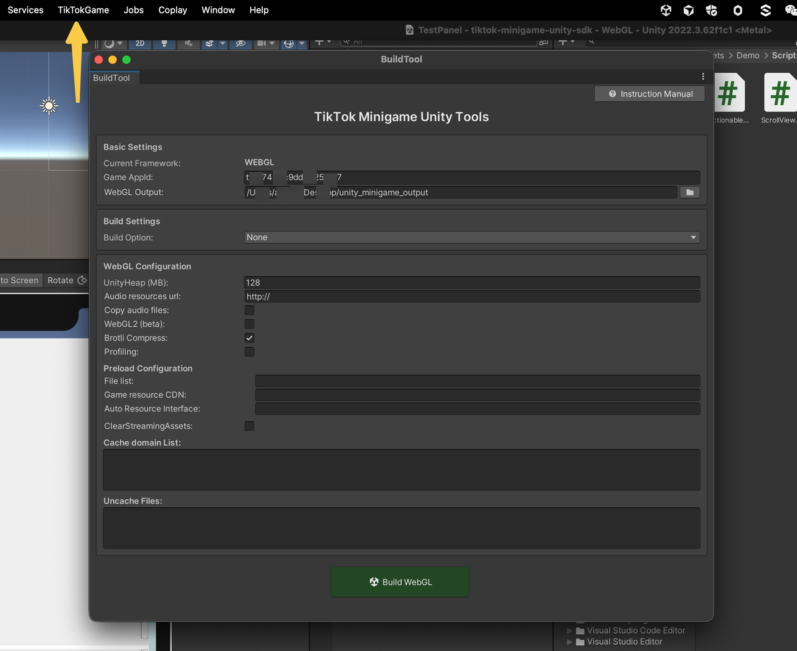
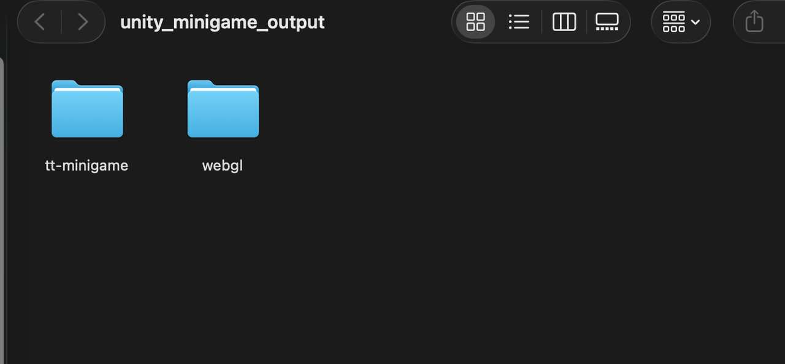
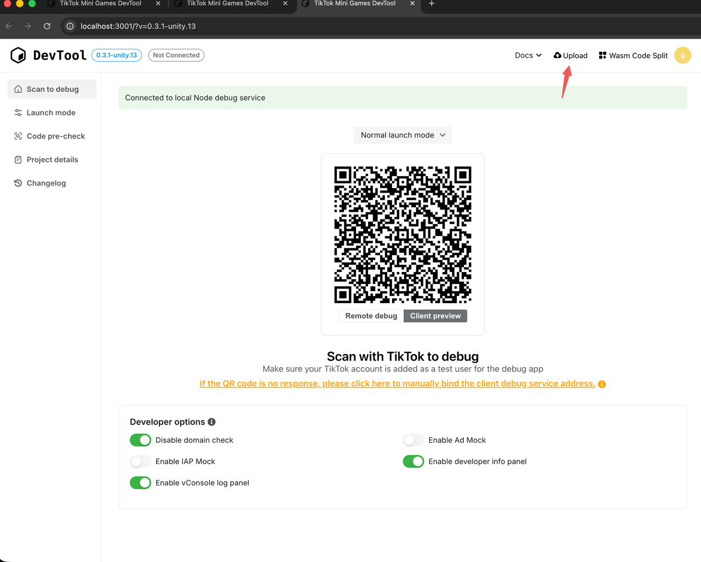

**【Tài liệu này ngừng cập nhật】 Hướng dẫn sử dụng TikTok Unity SDK (Tính năng thử nghiệm nội bộ)**

!!! Các game Unity đã lên sóng trước ngày 5/3, có thể tải lên (upload) lại nền tảng và phát hành bản mới. Chúng tôi đã thêm một bản tối ưu hóa hiệu suất, cần phải tải lên lại thì mới kích hoạt được.

Trong quá trình thử nghiệm nội bộ (Beta), nếu tiện, và nếu tôi có trong nhóm hỗ trợ/trao đổi của mọi người, khi mọi người lên sóng game Unity có thể tag `@@user 1285` một chút. Việc này giúp chúng tôi dễ dàng trải nghiệm và chuẩn bị cho các tối ưu hóa tiếp theo.

Tài liệu hướng dẫn phát triển và tích hợp Mini Game tổng hợp: TikTok Mini Game All in One // Hướng dẫn tích hợp một cửa TikTok Mini Game 2.0

Đề xuất tối ưu hóa việc đóng gói (build) Unity Mini Game

Phiên bản Client !!! `<android,ios> >= 4310`

Phiên bản Unity cli: https://www.npmjs.com/package/@ttmg/cli/v/0.3.3

Quy trình chia gói (sub-package) wasmcode cho TikTok Unity Mini Game

!!! Nếu một số người dùng máy tính để bàn Windows phát hiện không thể kết nối gỡ lỗi (debug) với `ttmg dev`, hãy chạy lệnh sau trong dòng lệnh (cần quyền quản trị viên / Administrator):
`netsh advfirewall set allprofiles state off`

Giới hạn kích thước tải lên của gói game Unity là 60M. Để đảm bảo hiệu suất game, vui lòng cố gắng kiểm soát dung lượng file `data` và `wasm` ở mức nhỏ nhất có thể, nếu không sẽ ảnh hưởng đến việc chạy quảng cáo.

**Bắt đầu (Get Started)**

**Beta:** Trong thời gian thử nghiệm nội bộ, SDK dưới đây sẽ được cập nhật thường xuyên, vui lòng đảm bảo bạn đang dùng phiên bản mới nhất!!!

Unity SDK package (import SDK dưới đây vào project Unity của bạn):
[com.tiktok.minigame@1.0.37-Beta.unitypackage](./Package/com.tiktok.minigame@1.0.37-Beta.unitypackage)

**Release:**

Công cụ build (đóng gói):


Tải lên sản phẩm sau khi build:


Tải lên thư mục `tt-minigame` này.
Khuyến nghị chạy lệnh `ttmg dev` ở bên trong thư mục `tt-minigame`: Tải lên thông qua lệnh upload của cli.


---

## Danh mục C# API

### 1. Bắt đầu nhanh

#### 1.1 Khai báo Namespace
```csharp
using TTSDK;
```

#### 1.2 Khởi tạo SDK
```csharp
void Start()
{
    TT.InitSDK((code, env) =>
    {
        if (code == 0)
        {
            Debug.Log("Khởi tạo SDK thành công");
            // Sau bước này có thể gọi các API khác
        }
    });
}
```

### 2. Khởi tạo

#### 2.1 InitSDK
Khởi tạo TTSDK, bắt buộc phải hoàn thành khởi tạo trước khi gọi tất cả các API.
```csharp
TT.InitSDK((code, env) =>
{
    // code: Mã lỗi, 0 nghĩa là thành công
    // env: Thông tin môi trường container
    Debug.Log($"Khởi tạo hoàn tất, GameAppId: {env.GameAppId}");
});
```

**Giải thích mã lỗi:**

| Code | Mô tả |
| :--- | :--- |
| 0 | Không có lỗi |
| 1 | Phiên bản TT Unity SDK không được hỗ trợ |
| 2 | Phiên bản Unity Engine không được hỗ trợ |

#### 2.2 InContainerEnv
Kiểm tra xem có đang chạy trong môi trường thiết bị thực TT Container hay không.
```csharp
if (TT.InContainerEnv)
{
    Debug.Log("Đang chạy trên môi trường thiết bị thực");
}
else
{
    Debug.Log("Đang chạy trên trình chỉnh sửa (Editor) hoặc môi trường không phải container");
}
```

#### 2.3 s_ContainerEnv
Lấy thông tin môi trường container.
```csharp
ContainerEnv env = TT.s_ContainerEnv;
```

### 3. Thông tin phiên bản

#### 3.1 TTSDKVersion
Lấy số phiên bản TTSDK.
```csharp
string sdkVersion = TT.TTSDKVersion;
// Ví dụ: "6.5.5"
```

#### 3.2 GameVersion
Lấy số phiên bản game (thay thế cho Application.version).
```csharp
string gameVersion = TT.GameVersion;
```

#### 3.3 GamePublishVersion
Lấy số phiên bản phát hành game (số phiên bản được chỉ định trong công cụ phát hành).
```csharp
string publishVersion = TT.GamePublishVersion;
```

#### 3.4 GetContainerVersion
Lấy số phiên bản SDK container trên thiết bị (client).
```csharp
string containerVersion = TT.GetContainerVersion();
// Ví dụ: "1.0.0"
```

#### 3.5 GetLaunchOptionsSync
Lấy các tham số khi khởi động Mini Game.
```csharp
LaunchOption options = TT.GetLaunchOptionsSync();
Debug.Log($"Scene: {options.Scene}, Path: {options.Path}");
```
⚠️ **Lưu ý:** Các tham số có thể rỗng (null), cần kiểm tra null trước khi sử dụng; cần được gọi sau khi có callback từ InitSDK.

#### 3.6 GetSystemInfo
Lấy thông tin hệ thống.
```csharp
TTSystemInfo systemInfo = TT.GetSystemInfo();
Debug.Log(systemInfo.Serialize());
```

### 4. Đăng nhập tài khoản

#### 4.1 Login
Đăng nhập để lấy thông tin xác thực đăng nhập tạm thời (credential).
```csharp
TT.Login(
    successCallback: (code) =>
    {
        // code: Thông tin xác thực đăng nhập tạm thời, dùng để máy chủ (server) đổi lấy openid
        Debug.Log($"Đăng nhập thành công, code: {code}");
    },
    failedCallback: (errMsg) =>
    {
        Debug.Log($"Đăng nhập thất bại: {errMsg}");
    }
);
```
**Giải thích:**
- `code` có thể dùng để đổi lấy `openid` (định danh duy nhất của người dùng)
- `anonymousCode` có thể dùng để đổi lấy `anonymous_openid` (giống nhau trên cùng một thiết bị)

#### 4.2 Authorize
Gửi yêu cầu ủy quyền (authorize) tới người dùng từ trước.
```csharp
TT.Authorize(
    scope: "user.info.basic",
    success: (token, data) =>
    {
        Debug.Log($"Ủy quyền thành công, token: {token}");
    },
    fail: (errCode, errMsg) =>
    {
        Debug.Log($"Ủy quyền thất bại: {errCode}, {errMsg}");
    }
);
```
**Các Scope thường dùng:**
- `user.info.basic` - Thông tin người dùng cơ bản

### 5. Hệ thống thanh toán

#### 5.1 CheckBalance
Kiểm tra xem số dư (balance) của người dùng có đủ không.
```csharp
TT.CheckBalance(new TTCheckBalanceParam
{
    amount = 100,
    type = "BEANS",
    success = (data) =>
    {
        Debug.Log($"Số dư đủ: {data.is_sufficient}");
    },
    fail = (error) =>
    {
        Debug.Log($"Kiểm tra thất bại: {error}");
    }
});
```

#### 5.2 Recharge
Mở giao diện nạp tiền.
```csharp
TT.Recharge(new TTRechargeParam
{
    tier_id = "tier_100",
    success = (data) =>
    {
        Debug.Log("Nạp tiền thành công");
    },
    fail = (error) =>
    {
        Debug.Log($"Nạp tiền thất bại: {error}");
    }
});
```

#### 5.3 Pay
Khởi tạo thanh toán.
```csharp
TT.Pay(new TTPayParam
{
    trade_order_id = "order_" + DateTime.Now.Ticks,
    success = (data) =>
    {
        Debug.Log("Thanh toán thành công");
    },
    fail = (error) =>
    {
        Debug.Log($"Thanh toán thất bại: {error}");
    }
});
```

#### 5.4 NavigateToBalance
Chuyển hướng (nhảy) đến trang số dư.
```csharp
TT.NavigateToBalance(new TTNavigateToBalanceParam
{
    success = (data) =>
    {
        Debug.Log("Chuyển hướng thành công");
    },
    fail = (error) =>
    {
        Debug.Log($"Chuyển hướng thất bại: {error}");
    }
});
```

### 6. Nhiệm vụ lối vào (Entrance Mission)

#### 6.1 StartEntranceMission
Bắt đầu nhiệm vụ lối vào.
```csharp
TT.StartEntranceMission(new TTStartEntranceMissionParam
{
    success = (data) =>
    {
        Debug.Log("Bắt đầu nhiệm vụ lối vào");
    },
    fail = (error) =>
    {
        Debug.Log($"Bắt đầu thất bại: {error}");
    }
});
```

#### 6.2 GetEntranceMissionReward
Nhận phần thưởng nhiệm vụ lối vào.
```csharp
TT.GetEntranceMissionReward(new TTGetEntranceMissionRewardParam
{
    success = (data) =>
    {
        Debug.Log("Nhận phần thưởng thành công");
    },
    fail = (error) =>
    {
        Debug.Log($"Nhận thất bại: {error}");
    }
});
```

### 7. Vòng đời Game

#### 7.1 GetAppLifeCycle
Lấy trình quản lý vòng đời ứng dụng.
```csharp
TTAppLifeCycle lifeCycle = TT.GetAppLifeCycle();

// Lắng nghe sự kiện hiển thị (Show)
lifeCycle.OnShow += (options) =>
{
    Debug.Log("Game vào chế độ foreground (tiền cảnh)");
};

// Lắng nghe sự kiện ẩn (Hide)
lifeCycle.OnHide += () =>
{
    Debug.Log("Game vào chế độ background (nền)");
};
```

#### 7.2 SetOnBeforeExitAppListener (Không hỗ trợ)
Lắng nghe sự kiện thoát game.
```csharp
TT.SetOnBeforeExitAppListener(() =>
{
    // Trả về true: Nhà phát triển tự xử lý logic thoát, có thể gọi TT.ExitMiniProgram() để thoát thủ công
    // Trả về false: Thoát game theo mặc định
    Debug.Log("Game sắp thoát");
    return false;
});
```

### 8. Hệ thống tập tin (File System)

#### 8.1 GetFileSystemManager
Lấy trình quản lý hệ thống tập tin.
```csharp
TTFileSystemManager fsManager = TT.GetFileSystemManager();
```

#### 8.2 CleanAllFileCache
Dọn dẹp tất cả bộ nhớ đệm (cache) tập tin.
```csharp
TT.CleanAllFileCache((success) =>
{
    Debug.Log($"Dọn dẹp cache: {(success ? "Thành công" : "Thất bại")}");
});
```

### 9. Lưu trữ dữ liệu

#### 9.1 PlayerPrefs
Nên dùng `using PlayerPrefs = TT.PlayerPrefs;`. Việc dùng `PlayerPrefs` có sẵn của Unity sẽ dẫn đến việc lưu trữ dữ liệu bền vững (persistent) bị thất bại.
Lưu trữ key-value hạng nhẹ (tương tự như `PlayerPrefs` của Unity). Hàm `HasKey` chưa được thực hiện.
```csharp
// Lưu trữ dữ liệu
TT.PlayerPrefs.SetInt("score", 100);
TT.PlayerPrefs.SetFloat("volume", 0.8f);
TT.PlayerPrefs.SetString("playerName", "Player1");

// Đọc dữ liệu
int score = TT.PlayerPrefs.GetInt("score");
float volume = TT.PlayerPrefs.GetFloat("volume");
string name = TT.PlayerPrefs.GetString("playerName");
```

#### 9.2 Save
Lưu dữ liệu game (hỗ trợ đối tượng phức tạp, giới hạn tối đa 50MB).
```csharp
// 1. Định nghĩa class lưu trữ có thể Serialize
[Serializable]
public class SaveData
{
    public int level = 1;
    public float progress = 0f;
    public string playerName = "";
    public List<string> items = new List<string>();
    public Dictionary<string, bool> achievements = new Dictionary<string, bool>();
}

// 2. Lưu dữ liệu
SaveData data = new SaveData 
{ 
    level = 10, 
    progress = 0.75f,
    playerName = "Hero"
};
bool saved = TT.Save(data, "my_save");
Debug.Log($"Lưu: {(saved ? "Thành công" : "Thất bại")}");
```

#### 9.3 LoadSaving
Tải (load) dữ liệu game.
```csharp
SaveData loaded = TT.LoadSaving<SaveData>("my_save");
if (loaded != null)
{
    Debug.Log($"Level đã tải: {loaded.level}");
}
```

#### 9.4 DeleteSaving
Xóa file lưu (save) được chỉ định.
```csharp
TT.DeleteSaving<SaveData>("my_save");
```

#### 9.5 ClearAllSavings
Xóa tất cả dữ liệu lưu (save).
```csharp
TT.ClearAllSavings();
```

#### 9.6 GetSavingDiskSize
Lấy tổng dung lượng của dữ liệu lưu trữ (save).
```csharp
long size = TT.GetSavingDiskSize();
Debug.Log($"Dung lượng save: {size} bytes ({size / 1024f:F2} KB)");
```

### 10. Khả năng mạng (Network Capabilities)

#### 10.1 GetNetWorkType
Lấy loại mạng hiện tại.
```csharp
TT.GetNetWorkType(new GetNetworkTypeParam
{
    Success = (result) =>
    {
        // Các giá trị có thể trả về: wifi, 2g, 3g, 4g, 5g, none, unknown
        Debug.Log($"Loại mạng: {result.NetworkType}");
    },
    Fail = (error) =>
    {
        Debug.Log($"Lấy thông tin mạng thất bại: {error}");
    }
});
```

#### 10.2 OnNetworkStatusChange
Lắng nghe sự thay đổi trạng thái mạng.
```csharp
TT.OnNetworkStatusChange((result) =>
{
    Debug.Log($"Mạng thay đổi: isConnected={result.IsConnected}, type={result.NetworkType}");
});
```

#### 10.3 OffNetworkStatusChange
Hủy lắng nghe sự thay đổi trạng thái mạng.
```csharp
// Hủy tất cả các lắng nghe
TT.OffNetworkStatusChange();

// Hoặc hủy một callback được chỉ định
TT.OffNetworkStatusChange(myCallback);
```

#### 10.4 OnNetworkWeakChange
Lắng nghe sự thay đổi trạng thái mạng yếu.
```csharp
TT.OnNetworkWeakChange((result) =>
{
    if (result.WeakNet)
    {
        Debug.Log("Mạng hiện tại khá yếu, khuyến nghị giảm chất lượng đồ họa");
    }
});
```

#### 10.5 OffNetworkWeakChange
Hủy lắng nghe sự thay đổi trạng thái mạng yếu.
```csharp
TT.OffNetworkWeakChange();
```

### 11. Phím tắt (Shortcut)

#### 11.1 AddShortcut
Tạo shortcut (lối tắt) trên màn hình chính.
```csharp
TT.AddShortcut(
    csCallback: (success) =>
    {
        Debug.Log($"Tạo shortcut: {(success ? "Thành công" : "Thất bại")}");
    }
);
```

#### 11.2 GetShortcutMissionReward
Lấy thông tin phần thưởng nhiệm vụ lối tắt.
```csharp
TT.GetShortcutMissionReward(new GetShortcutMissionRewardParam
{
    Success = (result) =>
    {
        if (result.CanReceiveReward)
        {
            Debug.Log("Người dùng có thể nhận phần thưởng lối tắt");
        }
        else
        {
            Debug.Log("Người dùng tạm thời chưa thể nhận phần thưởng");
        }
    },
    Fail = (error) =>
    {
        Debug.Log($"Lấy thông tin thất bại: {error.ErrMsg}");
    },
    Complete = () =>
    {
        Debug.Log("Yêu cầu hoàn tất");
    }
});
```

### 12. Chia sẻ xã hội (Social Share)

#### 12.1 ShareAppMessage
Chủ động gọi giao diện chia sẻ, chuyển đến màn hình chọn danh bạ.
```csharp
TT.ShareAppMessage(new ShareAppMessageParam
{
    ImageUrl = "https://example.com/image.jpg",  // Địa chỉ hình ảnh chia sẻ
    Subtitle = "Tiêu đề phụ",                           // Tiêu đề phụ
    TemplateType = 1,                             // Kiểu mẫu template: 1 hoặc 2
    Title = "Tiêu đề chính",                             // Tiêu đề chính
    Path = "a/b",                                 // Đường dẫn chia sẻ
    Query = "a=1&b=2",                            // Tham số truy vấn, định dạng key1=value1&key2=value2
    Success = () =>
    {
        Debug.Log("Chia sẻ thành công");
    },
    Fail = (error) =>
    {
        Debug.Log($"Chia sẻ thất bại: {error.ErrMsg}");
    },
    Complete = () =>
    {
        Debug.Log("Chia sẻ hoàn tất (được gọi dù thành công hay thất bại)");
    }
});
```

**Giải thích tham số:**

| Tham số | Kiểu dữ liệu | Bắt buộc | Mô tả |
| :--- | :--- | :--- | :--- |
| ImageUrl | string | Không | Địa chỉ hình ảnh chia sẻ |
| Subtitle | string | Không | Tiêu đề phụ |
| TemplateType | int | Không | Kiểu mẫu template, 1 hoặc 2, mặc định là 1 |
| Title | string | Không | Tiêu đề chính |
| Path | string | Không | Đường dẫn chia sẻ |
| Query | string | Không | Tham số truy vấn, định dạng key1=value1&key2=value2 |
| Success | Action | Có | Callback khi chia sẻ thành công |
| Fail | Action | Có | Callback khi chia sẻ thất bại |
| Complete | Action | Có | Callback khi chia sẻ hoàn tất (được gọi dù thành công hay thất bại) |

**Ví dụ sử dụng:**
```csharp
// Chia sẻ cấp độ game (level)
TT.ShareAppMessage(new ShareAppMessageParam
{
    ImageUrl = "https://your-cdn.com/level_share.jpg",
    Title = "Tôi đã qua bài số 10!",
    Subtitle = "Đến thử thách cùng tôi nào",
    TemplateType = 1,
    Path = "game/level",
    Query = "level=10&score=5000",
    Success = () =>
    {
        Debug.Log("Chia sẻ thành công, bạn bè có thể vào game qua link chia sẻ");
    },
    Fail = (error) =>
    {
        Debug.LogError($"Chia sẻ thất bại: {error.ErrMsg}");
    },
    Complete = () =>
    {
        // Có thể dọn dẹp (cleanup) một số thứ ở đây
    }
});
```

### 13. Hệ thống quảng cáo (Ad System)

#### 13.1 CreateRewardedVideoAd
Tạo quảng cáo video có phần thưởng (Rewarded Video Ad). Mỗi một thực thể (instance) quảng cáo chỉ có thể hiển thị một lần, nếu cần hiển thị quảng cáo ở những ngữ cảnh khác, bạn cần tạo mới rồi mới hiển thị lại.
```csharp
// Tạo thực thể quảng cáo
var rewardedAd = TT.CreateRewardedVideoAd(new CreateRewardedVideoAdParam
{
    AdUnitId = "your_ad_unit_id"  // Lấy từ developer backend (trang quản trị nhà phát triển)
});

// Lắng nghe sự kiện đóng (Close)
rewardedAd.OnClose += (isEnded) =>
{
    if (isEnded)
    {
        Debug.Log("Người dùng xem hết quảng cáo, trao phần thưởng");
        // TODO: Logic trao phần thưởng
    }
    else
    {
        Debug.Log("Người dùng đóng quảng cáo sớm, không trao phần thưởng");
    }
};

// Lắng nghe sự kiện lỗi
rewardedAd.OnError += (errorCode, errorMessage) =>
{
    Debug.Log($"Lỗi quảng cáo: {errorCode}, {errorMessage}");
};

// Hiển thị quảng cáo
rewardedAd.Show();
```

**Thực hành tốt nhất (Best Practice):**
```csharp
public class AdManager : MonoBehaviour
{
    private TTRewardedVideoAd _rewardedAd;
    private Action<bool> _rewardCallback;

    void Start()
    {
        // Tải trước (preload) quảng cáo
        PreloadRewardedAd();
    }

    void PreloadRewardedAd()
    {
        _rewardedAd = TT.CreateRewardedVideoAd(new CreateRewardedVideoAdParam
        {
            AdUnitId = "your_ad_unit_id"
        });

        _rewardedAd.OnClose += (isEnded) =>
        {
            _rewardCallback?.Invoke(isEnded);
            _rewardCallback = null;
            // Tải lại quảng cáo để dùng cho lần sau
            PreloadRewardedAd();
        };

        _rewardedAd.OnError += (code, msg) =>
        {
            Debug.LogError($"Lỗi quảng cáo: {code}, {msg}");
            _rewardCallback?.Invoke(false);
            _rewardCallback = null;
        };
    }

    public void ShowRewardedAd(Action<bool> callback)
    {
        _rewardCallback = callback;
        _rewardedAd?.Show();
    }
}
```

#### 13.2 CreateInterstitialAd
Tạo quảng cáo video xen kẽ (Interstitial Ad).
```csharp
// Tạo thực thể quảng cáo
var interstitialAd = TT.CreateInterstitialAd(new CreateInterstitialAdParam
{
    InterstitialAdId = "your_interstitial_ad_id"  // Lấy từ developer backend
});

// Lắng nghe sự kiện đóng
interstitialAd.OnClose += () =>
{
    Debug.Log("Quảng cáo xen kẽ đã đóng");
    // Logic xử lý sau khi quảng cáo đóng
};

// Lắng nghe sự kiện lỗi
interstitialAd.OnError += (errorCode, errorMessage) =>
{
    Debug.Log($"Lỗi quảng cáo xen kẽ: {errorCode}, {errorMessage}");
};

// Hiển thị quảng cáo
interstitialAd.Show();
```

**Lưu ý:**
- Không được phép hiển thị quảng cáo xen kẽ trong vòng 15 giây đầu tiên kể từ khi module quảng cáo khởi động (việc gọi bất kỳ API quảng cáo nào cũng sẽ khởi động module quảng cáo).
- Khoảng cách giữa 2 lần hiển thị quảng cáo xen kẽ không được ít hơn 30 giây.
- Quảng cáo xen kẽ hỗ trợ nhiều thực thể (multi-instance), có thể tạo nhiều thực thể ở các ngữ cảnh (scene) khác nhau.
- Mỗi thực thể quảng cáo xen kẽ chỉ hỗ trợ hiển thị một lần. Dù xảy ra lỗi tải (load error) hay hiển thị thành công, thực thể đều tự động bị hủy (destroy), lần sau phải tạo lại.
- Có thể gọi hàm `Destroy()` để tự hủy bỏ thực thể quảng cáo.

**Thực hành tốt nhất (Best Practice):**
```csharp
public class AdManager : MonoBehaviour
{
    private TTInterstitialAd _interstitialAd;
    private float _lastShowTime = 0f;
    private const float MIN_INTERVAL = 30f; // Khoảng cách tối thiểu 30 giây

    public void ShowInterstitialAd()
    {
        // Kiểm tra khoảng cách thời gian
        if (Time.time - _lastShowTime < MIN_INTERVAL)
        {
            Debug.Log($"Khoảng cách với lần hiển thị trước chưa đủ {MIN_INTERVAL} giây, vui lòng thử lại sau");
            return;
        }

        // Tạo thực thể quảng cáo xen kẽ mới
        _interstitialAd = TT.CreateInterstitialAd(new CreateInterstitialAdParam
        {
            InterstitialAdId = "your_interstitial_ad_id"
        });

        _interstitialAd.OnClose += () =>
        {
            Debug.Log("Quảng cáo xen kẽ đã đóng");
            _lastShowTime = Time.time;
            _interstitialAd = null;
        };

        _interstitialAd.OnError += (code, msg) =>
        {
            Debug.LogError($"Lỗi quảng cáo xen kẽ: {code}, {msg}");
            _interstitialAd = null;
        };

        // Hiển thị quảng cáo
        _interstitialAd.Show();
    }

    void OnDestroy()
    {
        // Dọn dẹp tài nguyên
        _interstitialAd?.Destroy();
    }
}
```

### 14. Báo cáo sự kiện (Event Reporting)

#### 14.1 ReportEvent
Giao diện báo cáo sự kiện tùy chỉnh (Custom event reporting).
```csharp
TT.ReportEvent(new ReportEventParam
{
    eventName = "your-event-name",
    @params = new JsonData
    {
        ["key1"] = "value1",
        ["key2"] = "value2"
    },
    success = () =>
    {
        Debug.Log("Báo cáo sự kiện thành công");
    },
    fail = () =>
    {
        Debug.Log("Báo cáo sự kiện thất bại");
    },
    complete = () =>
    {
        Debug.Log("Báo cáo sự kiện hoàn tất (được gọi dù thành công hay thất bại)");
    }
});
```

**Giải thích tham số:**

| Tham số | Kiểu dữ liệu | Bắt buộc | Mô tả |
| :--- | :--- | :--- | :--- |
| eventName | string | Có | Tên sự kiện |
| @params | JsonData | Không | Tham số sự kiện, định dạng key-value |
| success | Action | Không | Hàm callback khi gọi API thành công |
| fail | Action | Không | Hàm callback khi gọi API thất bại |
| complete | Action | Không | Hàm callback khi kết thúc lệnh gọi API (được gọi dù thành công hay thất bại) |

**Ví dụ sử dụng:**
```csharp
// Báo cáo sự kiện hoàn thành cấp độ (level) game
TT.ReportEvent(new ReportEventParam
{
    eventName = "level_complete",
    @params = new JsonData
    {
        ["level"] = 10,
        ["score"] = 5000,
        ["time"] = 120
    },
    success = () =>
    {
        Debug.Log("Báo cáo sự kiện hoàn thành level thành công");
    },
    fail = () =>
    {
        Debug.LogError("Báo cáo sự kiện hoàn thành level thất bại");
    },
    complete = () =>
    {
        // Có thể dọn dẹp (cleanup) một số thứ ở đây
    }
});

// Báo cáo sự kiện hành vi người dùng
TT.ReportEvent(new ReportEventParam
{
    eventName = "user_action",
    @params = new JsonData
    {
        ["action"] = "button_click",
        ["button_id"] = "shop_enter",
        ["timestamp"] = DateTime.Now.Ticks
    },
    success = () => Debug.Log("Báo cáo sự kiện hành vi người dùng thành công"),
    fail = () => Debug.LogError("Báo cáo sự kiện hành vi người dùng thất bại")
});
```

**Lưu ý:**
- `eventName` không được để trống (null hoặc empty).
- `@params` có thể là null, nếu là null sẽ tự động được chuyển đổi thành một đối tượng rỗng `{}`.
- Tất cả các hàm callback đều là tùy chọn (optional) và có thể gán bằng null.

### 15. Chức năng rung (Vibration Function)

#### 15.1 VibrateShort
Khiến điện thoại rung trong một thời gian ngắn.
```csharp
TT.VibrateShort(new VibrateShortParam
{
    Success = (result) =>
    {
        Debug.Log("Rung ngắn thành công");
    },
    Fail = (error) =>
    {
        Debug.Log($"Rung thất bại: Code={error.ErrorCode}, Msg={error.ErrMsg}");
    },
    Complete = () =>
    {
        Debug.Log("Hoàn tất lệnh rung");
    }
});
```

**Thời gian rung:**
- Android: 30ms
- iOS: 15ms

**Giải thích tham số:**

| Tham số | Kiểu dữ liệu | Mô tả |
| :--- | :--- | :--- |
| Success | VibrateShortSuccessCallback | Hàm callback khi rung thành công (tùy chọn) |
| Fail | Action<ErrorInfo> | Hàm callback khi rung thất bại (tùy chọn) |
| Complete | Action | Hàm callback khi kết thúc lệnh rung (tùy chọn, được gọi dù thành công hay thất bại) |

**Ngữ cảnh sử dụng:**
- Phản hồi khi nhấn nút (button click feedback)
- Lời nhắc xác nhận thao tác
- Lời nhắc lỗi nhẹ

#### 15.2 VibrateLong
Khiến điện thoại rung trong một thời gian dài hơn.
```csharp
TT.VibrateLong(new VibrateLongParam
{
    Success = (result) =>
    {
        Debug.Log("Rung dài thành công");
    },
    Fail = (error) =>
    {
        Debug.Log($"Rung thất bại: Code={error.ErrorCode}, Msg={error.ErrMsg}");
    },
    Complete = () =>
    {
        Debug.Log("Hoàn tất lệnh rung");
    }
});
```

**Thời gian rung:**
- Tất cả các nền tảng: 400ms

**Giải thích tham số:**

| Tham số | Kiểu dữ liệu | Mô tả |
| :--- | :--- | :--- |
| Success | VibrateLongSuccessCallback | Hàm callback khi rung thành công (tùy chọn) |
| Fail | Action<ErrorInfo> | Hàm callback khi rung thất bại (tùy chọn) |
| Complete | Action | Hàm callback khi kết thúc lệnh rung (tùy chọn, được gọi dù thành công hay thất bại) |

**Ngữ cảnh sử dụng:**
- Xác nhận thao tác quan trọng
- Lời nhắc lỗi nghiêm trọng
- Thông báo sự kiện game (ví dụ: nhận thưởng, hoàn thành nhiệm vụ, v.v.)

**Ví dụ hoàn chỉnh:**
```csharp
using TTSDK;
using UnityEngine;

public class VibrationExample : MonoBehaviour
{
    void OnButtonClick()
    {
        // Kích hoạt rung ngắn khi nhấn nút
        TT.VibrateShort(new VibrateShortParam
        {
            Success = (result) =>
            {
                Debug.Log("Phản hồi rung cho nút bấm thành công");
            },
            Fail = (error) =>
            {
                Debug.LogWarning($"Rung thất bại: {error.ErrMsg}");
            }
        });
    }

    void OnImportantEvent()
    {
        // Kích hoạt rung dài khi có sự kiện quan trọng
        TT.VibrateLong(new VibrateLongParam
        {
            Success = (result) =>
            {
                Debug.Log("Thông báo rung sự kiện quan trọng thành công");
            },
            Fail = (error) =>
            {
                Debug.LogWarning($"Rung thất bại: {error.ErrMsg}");
            }
        });
    }
}
```

**Lưu ý:**
- Cần thử nghiệm trên thiết bị thực hoặc thiết bị có hỗ trợ chức năng rung.
- Nền tảng WebGL cũng hỗ trợ chức năng rung.
- Nếu thiết bị không hỗ trợ rung hoặc không đủ quyền hạn, thông báo lỗi sẽ được trả về trong callback `Fail`.
- Khuyến nghị sử dụng rung ngắn cho phản hồi thao tác của người dùng, sử dụng rung dài để thông báo sự kiện quan trọng.
- Tránh gọi lệnh rung liên tục để không ảnh hưởng đến trải nghiệm người dùng.

### 16. Kiểm tra tính khả dụng của API (CanIUse)

#### 16.1 Tổng quan
`CanIUse` được sử dụng để kiểm tra xem một API có sẵn (khả dụng) trên nền tảng và phiên bản hiện tại hay không. Trước khi gọi một API có khả năng không được hỗ trợ, khuyến nghị sử dụng `CanIUse` để kiểm tra trước nhằm tránh các lỗi xảy ra trong thời gian chạy (runtime errors).

#### 16.2 Cách sử dụng cơ bản
```csharp
using TTSDK;

// Kiểm tra xem API có khả dụng không
if (CanIUse.GetSystemInfo)
{
    // API khả dụng, gọi an toàn
    var systemInfo = TT.GetSystemInfo();
    Debug.Log($"Nền tảng: {systemInfo.platform}");
}
else
{
    // API không khả dụng, sử dụng phương án dự phòng (downgrade)
    Debug.Log("GetSystemInfo hiện không có sẵn (not available)");
}
```

#### 16.3 Các kịch bản sử dụng thực tế (Ví dụ)

**Kịch bản 1: Kích hoạt tính năng theo điều kiện**
```csharp
void InitializeFeatures()
{
    // Chỉ kích hoạt nút rung khi chức năng rung được hỗ trợ
    if (CanIUse.VibrateShort && CanIUse.VibrateLong)
    {
        vibrationButton.gameObject.SetActive(true);
    }
    else
    {
        vibrationButton.gameObject.SetActive(false);
        Debug.Log("Chức năng rung không có sẵn, đã ẩn nút rung");
    }
}
```

**Kịch bản 2: Xử lý dự phòng (Downgrade processing)**
```csharp
void ShareContent()
{
    // Ưu tiên sử dụng API chia sẻ mới
    if (CanIUse.ShareMessageToFriend)
    {
        TT.ShareAppMessage(new ShareAppMessageParam
        {
            // ... Các tham số chia sẻ
        });
    }
    else
    {
        // Chuyển sang phương thức chia sẻ khác hoặc thông báo cho người dùng
        Debug.Log("Tính năng chia sẻ không có sẵn");
        ShowToast("Phiên bản hiện tại không hỗ trợ tính năng chia sẻ");
    }
}
```

#### 16.4 Lưu ý
1. Kiểm tra sau khi khởi tạo: Việc kiểm tra `CanIUse` nên được thực hiện sau khi `TT.InitSDK()` hoàn tất.

#### 16.5 Danh sách thuộc tính CanIUse phổ biến

| Thuộc tính CanIUse | Mô tả | Yêu cầu phiên bản Client |
| :--- | :--- | :--- |
| GetSystemInfo | Lấy thông tin hệ thống | Không có |
| VibrateShort | Rung ngắn | >= 43.8.0 |
| VibrateLong | Rung dài | >= 43.8.0 |
| GetFileSystemManager | Quản lý tệp (File Manager) | Không có |

### 17. Bảng tra cứu nhanh API

| API | Chức năng |
| :--- | :--- |
| **Khởi tạo** | |
| InitSDK | Khởi tạo SDK |
| InContainerEnv | Kiểm tra môi trường thiết bị thực |
| **Thông tin phiên bản** | |
| TTSDKVersion | Phiên bản SDK |
| GameVersion | Phiên bản game |
| GamePublishVersion | Phiên bản phát hành |
| GetContainerVersion | Phiên bản container |
| GetLaunchOptionsSync | Tham số khởi động |
| GetSystemInfo | Thông tin hệ thống |
| **Tài khoản** | |
| Login | Đăng nhập |
| Authorize | Ủy quyền |
| **Thanh toán** | |
| CheckBalance | Kiểm tra số dư |
| Recharge | Nạp tiền |
| Pay | Thanh toán |
| NavigateToBalance | Chuyển hướng đến trang số dư |
| **Nhiệm vụ lối vào** | |
| StartEntranceMission | Bắt đầu nhiệm vụ |
| GetEntranceMissionReward | Nhận phần thưởng |
| **Vòng đời** | |
| GetAppLifeCycle | Trình quản lý vòng đời |
| SetOnBeforeExitAppListener | Lắng nghe khi thoát |
| **Hệ thống tập tin** | |
| GetFileSystemManager | Quản lý tệp |
| CleanAllFileCache | Dọn dẹp cache |
| **Lưu trữ dữ liệu** | |
| PlayerPrefs | Lưu trữ Key-value |
| Save | Lưu dữ liệu |
| LoadSaving | Tải dữ liệu |
| DeleteSaving | Xóa dữ liệu |
| ClearAllSavings | Xóa tất cả dữ liệu |
| GetSavingDiskSize | Dung lượng dữ liệu lưu trữ |
| **Mạng** | |
| GetNetWorkType | Lấy loại mạng |
| OnNetworkStatusChange | Lắng nghe trạng thái mạng |
| OffNetworkStatusChange | Hủy lắng nghe trạng thái mạng |
| OnNetworkWeakChange | Lắng nghe mạng yếu |
| OffNetworkWeakChange | Hủy lắng nghe mạng yếu |
| **Phím tắt** | |
| AddShortcut | Tạo shortcut |
| GetShortcutMissionReward | Phần thưởng lối tắt |
| **Chia sẻ xã hội** | |
| ShareAppMessage | Chia sẻ tin nhắn |
| **Quảng cáo** | |
| CreateRewardedVideoAd | Quảng cáo video có phần thưởng |
| CreateInterstitialAd | Quảng cáo xen kẽ |

### Lưu ý quan trọng
1. **Ưu tiên khởi tạo:** Tất cả các API bắt buộc phải được gọi sau khi callback của `TT.InitSDK()` hoàn tất.
2. **Xác định môi trường:** Sử dụng `TT.InContainerEnv` để đánh giá xem có đang chạy trong môi trường thiết bị thực (real device) hay không.
3. **Xử lý lỗi:** Tất cả các giao diện (interface) bất đồng bộ đều nên được xử lý ở callback thất bại (fail).
4. **Giới hạn lưu trữ:** Dung lượng lưu trữ dữ liệu tối đa của game là 50MB.
